# SOC Incident Investigation: The BUYER — Ashford Sterling Recruitment

**Analyst:** Tiernan Falcon\
**Date Completed:** 15 March 2026 JST\
**Environment Investigated:** Ashford Sterling Recruitment (`as-pc2`, `as-srv`)\
**Timeframe:** 27 January 2026 (UTC)\
**Platform:** Microsoft Defender for Endpoint (MDE) + Microsoft Sentinel — KQL / Log Analytics Workspace\
**Source:** Cyber Range with SancLogic

---

## Table of Contents

1. [Executive Summary](#executive-summary)
2. [Key Findings](#key-findings)
3. [Environment & Hunt Scope](#environment--hunt-scope)
4. [All Flags Quick Reference](#all-flags-quick-reference)
5. [Attack Timeline](#attack-timeline)
6. [Flag-by-Flag Analysis](#flag-by-flag-analysis)
7. [Conclusion](#conclusion)
8. [Remediation Recommendations](#remediation-recommendations)
9. [MITRE ATT&CK Mapping](#mitre-attck-mapping)
10. [Final Thoughts & What I Learned](#final-thoughts--what-i-learned)
11. [Credits](#credits)
12. [Disclaimer](#disclaimer)

---

## Executive Summary

The **BUYER** documents the return of the threat actor from the earlier **BROKER** investigation against Ashford Sterling Recruitment. Rather than establishing access through a new intrusion, the actor appears to have re-entered the environment using access deliberately established during the prior compromise, then progressed quickly through defense evasion, credential access, reconnaissance, data staging, and ransomware deployment.

The operation culminated in Akira ransomware execution across the affected systems. File telemetry showed encrypted content adopting the `.akira` extension, while the ransom note identified the actor as Akira and confirmed the victim’s negotiation portal. Supporting network telemetry also linked the activity to the same `cloud-endpoint.net` infrastructure family observed during the earlier intrusion. The actor reused `AnyDesk` as a remote access channel, reaching `as-pc2` from an external IP address while operating under the compromised `david.mitchell` account.

Before encryption, the actor disabled Microsoft Defender, modified security-related registry settings, and conducted credential access activity consistent with LSASS targeting. When an earlier payload proved ineffective, it was replaced with a new executable staged in `C:\ProgramData`, after which the actor shifted to local reconnaissance and internal discovery. Additional telemetry showed network scanning from the compromised host and subsequent access to `as-srv` using the `as.srv.administrator` account.

Collection and staging activity occurred before impact. Tool transfer telemetry indicated the use of both `bitsadmin` and PowerShell to retrieve additional utilities, while a separate staging tool compressed data for likely exfiltration prior to encryption. The ransomware itself was staged onto `as-srv`, Volume Shadow Copies were deleted to inhibit recovery, and the ransom note was dropped as encryption began. Post-execution cleanup followed, including deletion of the ransomware binary to reduce forensic visibility. The confirmed scope of compromise in this incident was limited to `as-pc2` and `as-srv`.

This investigation was reconstructed solely from MDE and Sentinel telemetry using KQL in Log Analytics Workspace. No endpoint shell access, packet capture, disk imaging, or memory forensics were available. All findings were therefore derived through correlation of process, file, registry, network, logon, and alert telemetry. Where a detail was directly established by the evidence, it is treated as confirmed. Where the broader narrative required correlation across multiple events, conclusions have been stated conservatively and only where supported by the telemetry.

## Hunt Narrative

**Sections 1–4: Impact, Infrastructure, and Defense Evasion**

We started from impact and worked backward. The ransom note answered the first four questions almost immediately: it identified the actor as Akira, exposed the TOR negotiation portal, and included the victim ID assigned to Ashford Sterling Recruitment. File telemetry on the affected systems supported that attribution, with encrypted content adopting the `.akira` extension. From there, we pivoted into the supporting infrastructure and found the operation tied back to the same `cloud-endpoint.net` domain family seen in the earlier intrusion. `sync.cloud-endpoint.net` handled payload delivery, while `cdn.cloud-endpoint.net` was used to stage the ransomware. Resolving those domains also returned `104.21.30.237` and `172.67.174.46`, reinforcing the infrastructure overlap with The BROKER rather than pointing to a wholly separate intrusion.

We then moved earlier in the timeline to understand how the actor prepared the host for impact. `kill.bat` stood out immediately as the evasion script used to impair host protections. Pulling its file telemetry gave us the SHA256 hash `0e7da57d92eaa6bda9d0bbc24b5f0827250aa42f295fd056ded50c6e3c3fb96c`, while registry telemetry confirmed that the `DisableAntiSpyware` value was written at `21:03:42 UTC`. That timestamp became an important anchor in the sequence. Once Defender had been disabled, the rest of the intrusion progressed quickly.

**Sections 5–6: Return Access and Beacon Replacement**

The next question was whether this actor broke in again or simply returned through access they had already established. The evidence strongly supported the latter. `AnyDesk` had been deployed during the earlier intrusion and was now reused as the remote access channel into `as-pc2`. Network telemetry showed the connection originating from `88.97.164.155`, while host and logon context placed the actor under the compromised `david.mitchell` account. Rather than rebuilding access from scratch, the actor appears to have resumed operations through the foothold planted during The BROKER.

The command-and-control trail showed a similar pattern. A pre-staged beacon from the earlier intrusion was present, but file history indicated it was not sufficient to maintain reliable communications. Looking at `C:\ProgramData`, we found a payload named `wsync` with two separate hashes over the course of the intrusion: the original (`66b876c5...`) and a later replacement (`0072ca0d...`). Tracking the file history rather than the filename alone showed that the beacon had been swapped out after the first version failed, allowing the actor to re-establish stable control before continuing.

**Sections 7–10: Reconnaissance, Movement, and Collection**

Once access was stable, the actor moved into local reconnaissance and internal discovery. `scan.exe` was one of the first tools that stood out in the process telemetry. It was launched with `/portable "C:/Users/David.Mitchell/Downloads/" /lng en_us`, suggesting a self-contained operator utility run directly from the user profile rather than a formally installed tool. Network activity tied that scanner to internal enumeration against `10.1.0.183` and `10.1.0.203`, giving us a clear view of the actor mapping reachable systems before moving further.

From there, we tracked the move into the file server. Authentication telemetry showed `as.srv.administrator` used to access `as-srv`, confirming the lateral movement step into the server that would later become the impact point. We also saw the actor adapt their tooling as they went. `bitsadmin` appeared first as the downloader, but later process activity showed PowerShell `Invoke-WebRequest` used as a fallback when the earlier method proved unreliable. That same pattern of adaptation carried into collection and staging. A separate utility named `st` created `exfil_data.zip`, which stood out as the clearest staging artifact in the case. Even without direct file content visibility, the sequence strongly supports data preparation for theft before the ransomware was launched.

**Sections 11–12: Impact and Cleanup**

With staging complete, the actor moved into impact. The ransomware binary was staged onto `as-srv` by `powershell.exe` under the name updater and executed as `updater.exe`. We then found `vssadmin delete shadows /all /quiet`, confirming the deletion of Volume Shadow Copies immediately before encryption. The ransom note was dropped at `22:18:33 UTC`, which became the cleanest on-host marker for the start of the ransomware event. Pulling the file telemetry also gave us the ransomware hash (`e609d070...`), but the surrounding behavior was just as important: defenses had already been disabled, command-and-control had already been stabilized, and staging had already been completed before encryption began.

The final step was cleanup. `clean.bat` deleted the ransomware binary after execution, an obvious attempt to reduce post-incident recovery and limit straightforward forensic collection from disk. Even so, the activity remained visible in MDE telemetry. Mapping the affected systems through the available evidence confirmed `as-pc2` and `as-srv` as the impacted hosts in The BUYER. Unlike a full-environment detonation, this was a more contained return intrusion, but the effect on those systems was still severe.

---

## Key Findings

- Confirmed Akira ransomware impact, with the ransom note identifying the negotiation portal, victim ID `813R-QWJM-XKIJ`, and encrypted files adopting the `.akira` extension
- Identified reused external infrastructure associated with the earlier intrusion: `sync.cloud-endpoint.net` used for payload delivery, `cdn.cloud-endpoint.net` used to stage the ransomware, and supporting resolution to `104.21.30.237` and `172.67.174.46`
- Confirmed reused remote access via `AnyDesk` on `as-pc2`, with the return connection originating from `88.97.164.155` under the compromised `david.mitchell` account
- Defense evasion confirmed: `kill.bat` executed to impair host protections, with SHA256 `0e7da57d92eaa6bda9d0bbc24b5f0827250aa42f295fd056ded50c6e3c3fb96c`; registry telemetry showed modification of `DisableAntiSpyware` at `21:03:42 UTC`
- Credential access activity targeting LSASS confirmed through process enumeration and access to `Device\NamedPipe\lsass`
- Beacon replacement on `as-pc2` confirmed: `wsync` deployed to `C:\ProgramData`, with the original hash `66b876c52946f4aed47dd696d790972ff265b6f4451dab54245bc4ef1206d90b` replaced by `0072ca0d0adc9a1b2e1625db4409f57fc32b5a09c414786bf08c4d8e6a073654` after the first version failed
- Reconnaissance confirmed via `scan.exe`, launched with `/portable "C:/Users/David.Mitchell/Downloads/" /lng en_us`, with enumeration activity against `10.1.0.154` and `10.1.0.183`
- Lateral movement to `as-srv` confirmed under the `as.srv.administrator` account
- Tool transfer sequence identified: `bitsadmin` used first, followed by PowerShell `Invoke-WebRequest` as a fallback retrieval method
- Pre-impact staging confirmed: utility `st` (SHA256 `512a1f4ed9f512572608c729a2b89f44ea66a40433073aedcd914bd2d33b7015`) created `exfil_data.zip` prior to ransomware execution
- Ransomware deployment confirmed: `updater.exe` (SHA256 `e609d070ee9f76934d73353be4ef7ff34b3ecc3a2d1e5d052140ed4cb9e4752b`) staged by `powershell.exe`, executed on `as-srv`, deleted shadow copies via `vssadmin delete shadows /all /quiet`, and dropped the ransom note at `22:18:33 UTC` as encryption began
- Anti-forensics confirmed: `clean.bat` deleted the ransomware binary after execution to reduce forensic visibility
- Confirmed impact scope limited to `as-pc2` and `as-srv`
- 40 flags resolved across 12 attack phases

---

## Environment & Hunt Scope

#### Monitored Systems

- `as-pc2` — Re-entry workstation; reused remote access AnyDesk foothold; source of beacon replacement, reconnaissance, and staging activity
- `as-srv` — File server; lateral movement target and primary impact host for ransomware staging and encryption 

#### Prior Context

- **The BUYER** is explicitly a follow-on intrusion to **The BROKER**
- The actor returned using **pre-staged access**
- Infrastructure and remote access artifacts overlapped with the earlier case, especially the `cloud-endpoint.net` domain family and AnyDesk-related activity

#### Data Sources Available

- Microsoft Defender for Endpoint (MDE) via Microsoft Sentinel / Log Analytics Workspace
  - `DeviceProcessEvents` — process execution and command-line telemetry
  - `DeviceFileEvents` — file creation, modification, and hash visibility
  - `DeviceNetworkEvents` — outbound connections, remote URLs, remote IPs
  - `DeviceRegistryEvents` — registry write activity and value changes
  - `DeviceLogonEvents` — successful authentication and logon session data
  - `DeviceEvents` — broader system and telemetry events, including named pipe activity
  - `search` / workspace-wide lookup — fast retrieval of note strings, victim IDs, and portal artifacts captured in alerts or event text

#### Investigation Constraints

- No direct endpoint access, memory dumps, disk forensics, or packet capture
- No direct interaction with attacker-controlled infrastructure
- No malware detonation or reverse engineering of recovered samples

All findings were reconstructed through behavioral correlation of process, file, registry, network, and logon telemetry. Where a value was directly established by the evidence, it was treated as confirmed. Where sequence or intent could not be proven from a single event, findings were validated across multiple independent telemetry sources before being included in the report. Because no direct endpoint or memory access was available, MDE and Sentinel telemetry provided the sole basis for reconstructing the intrusion.

---


## All Flags Quick Reference

| # | Section | Flag Name | Answer / Finding |
|---|---|---|---|
| 1 | Ransom Note Analysis | Threat Actor | `Akira` |
| 2 | Ransom Note Analysis | Negotiation Portal | `akiral2iz6a7qgd3ayp3l6yub7xx2uep76idk3u2kollpj5z3z636bad.onion` |
| 3 | Ransom Note Analysis | Victim ID | `813R-QWJM-XKIJ` |
| 4 | Ransom Note Analysis | Encrypted Extension | `.akira` |
| 5 | Infrastructure | Payload Domain | `sync.cloud-endpoint.net` |
| 6 | Infrastructure | Ransomware Staging | `cdn.cloud-endpoint.net` |
| 7 | Infrastructure | C2 IP Addresses | `104.21.30.237, 172.67.174.46` |
| 8 | Infrastructure | Remote Tool Relay | `relay-0b975d23.net.anydesk.com` |
| 9 | Defense Evasion | Evasion Script | `kill.bat` |
| 10 | Defense Evasion | Evasion Hash | `0e7da57d92eaa6bda9d0bbc24b5f0827250aa42f295fd056ded50c6e3c3fb96c` |
| 11 | Defense Evasion | Registry Tampering | `DisableAntiSpyware` |
| 12 | Defense Evasion | Registry Timestamp | `21:03:42` |
| 13 | Credential Access | Process Hunt | `tasklist | findstr lsass` |
| 14 | Credential Access | Credential Pipe | `Device\NamedPipe\lsass` |
| 15 | Initial Access | Remote Access Tool | `AnyDesk` |
| 16 | Initial Access | Suspicious Execution Path | C:\Users\Public
| 17 | Initial Access | Attacker IP | `88.97.164.155` |
| 18 | Initial Access | Compromised User | `david.mitchell` |
| 19 | Command & Control | Primary Beacon | `wsync` |
| 20 | Command & Control | Beacon Location | `C:\ProgramData` |
| 21 | Command & Control | Original Beacon Hash | `66b876c52946f4aed47dd696d790972ff265b6f4451dab54245bc4ef1206d90b` |
| 22 | Command & Control | Replacement Beacon Hash | `0072ca0d0adc9a1b2e1625db4409f57fc32b5a09c414786bf08c4d8e6a073654` |
| 23 | Reconnaissance | Scanner Tool | `scan.exe` |
| 24 | Reconnaissance | Scanner Hash | `26d5748ffe6bd95e3fee6ce184d388a1a681006dc23a0f08d53c083c593c193b` |
| 25 | Reconnaissance | Scanner Execution | `/portable "C:/Users/David.Mitchell/Downloads/" /lng en_us` |
| 26 | Reconnaissance | Network Enumeration | `10.1.0.154, 10.1.0.183` |
| 27 | Lateral Movement | Lateral Account | `as.srv.administrator` |
| 28 | Tool Transfer | Download Method | `bitsadmin` |
| 29 | Tool Transfer | Fallback Method | `Invoke-WebRequest` |
| 30 | Exfiltration | Staging Tool | `st` |
| 31 | Exfiltration | Staging Hash | `512a1f4ed9f512572608c729a2b89f44ea66a40433073aedcd914bd2d33b7015` |
| 32 | Exfiltration | Exfil Archive | `exfil_data.zip` |
| 33 | Ransomware Deployment | Ransomware Filename | `updater.exe` |
| 34 | Ransomware Deployment | Ransomware Hash | `e609d070ee9f76934d73353be4ef7ff34b3ecc3a2d1e5d052140ed4cb9e4752b` |
| 35 | Ransomware Deployment | Ransomware Staging | `powershell.exe` |
| 36 | Ransomware Deployment | Recovery Prevention | `vssadmin delete shadows /all /quiet` |
| 37 | Ransomware Deployment | Ransom Note Origin | `updater.exe` |
| 38 | Ransomware Deployment | Encryption Start | `22:18:33` |
| 39 | Anti-Forensics & Scope | Cleanup Script | `clean.bat` |
| 40 | Anti-Forensics & Scope | Affected Hosts | `as-pc2, as-srv` |


---

## Attack Timeline

> **Analyst Note:** Unlike The BROKER, the solved flag set for The BUYER preserved two precise clock anchors: **21:03:42 UTC** for the Defender-disabling registry modification and **22:18:33 UTC** for the ransom-note drop. The full workspace retains the exact calendar dates for every event, but because those dates were not part of the solved flag set itself, the timeline below uses confirmed order, exact UTC times where recovered, and conservative relative phrasing elsewhere.

| Time / Sequence (UTC) | Tactic | Action | Key Artifact |
|---|---|---|---|
| Start of return intrusion window | Initial Access / Persistence | Actor reconnects to `as-pc2` through pre-staged AnyDesk access | `AnyDesk`, `88.97.164.155` |
| Early foothold activity | Command and Control | Replacement beacon deployed after earlier beacon instability | `wsync`, `C:\ProgramData` |
| 21:03:42 | Defense Evasion | Windows Defender disabled through registry policy tampering | `kill.bat`, `DisableAntiSpyware` |
| Immediately after evasion | Credential Access | Actor enumerates LSASS and accesses its named pipe | `tasklist | findstr lsass`, `Device\NamedPipe\lsass` |
| Post-evasion discovery phase | Reconnaissance | Portable scanner launched from David Mitchell's Downloads directory | `scan.exe`, `/portable "C:/Users/David.Mitchell/Downloads/" /lng en_us` |
| Same discovery window | Reconnaissance | Internal share targets enumerated | `10.1.0.154`, `10.1.0.183` |
| Server access phase | Lateral Movement | `as-srv` accessed under elevated server-side credentials | `as.srv.administrator` |
| Tool transfer phase | Ingress Tool Transfer | Initial download via `bitsadmin` fails; PowerShell fallback succeeds | `bitsadmin`, `Invoke-WebRequest` |
| Pre-impact collection | Collection | Data compressed into archive for theft | `st`, `exfil_data.zip` |
| Pre-encryption staging | Execution | Ransomware staged onto `as-srv` | `updater`, `powershell.exe` |
| Immediately before impact | Impact | Shadow copies deleted to prevent recovery | `vssadmin delete shadows /all /quiet` |
| 22:18:33 | Impact | `updater.exe` drops the ransom note and encryption begins | `updater.exe`, `.akira` |
| Post-execution cleanup | Defense Evasion | Ransomware binary deleted after execution | `clean.bat` |
| Final scope confirmation | Impact | Confirmed impacted hosts | `as-pc2`, `as-srv` |

### Kill Chain Diagram

```mermaid
flowchart LR
    A[Pre-staged AnyDesk access<br/>Return to as-pc2] --> B[Beacon replacement<br/>wsync in C:\ProgramData]
    B --> C[Defense Evasion<br/>kill.bat + DisableAntiSpyware]
    C --> D[Credential Access<br/>LSASS hunt + named pipe]
    D --> E[Reconnaissance<br/>scan.exe + share enumeration]
    E --> F[Lateral Movement<br/>as.srv.administrator to as-srv]
    F --> G[Tool Transfer<br/>bitsadmin then Invoke-WebRequest]
    G --> H[Collection<br/>st creates exfil_data.zip]
    H --> I[Ransomware Staging<br/>powershell.exe drops updater.exe]
    I --> J[Impact<br/>vssadmin + Akira encryption]
    J --> K[Cleanup<br/>clean.bat deletes payload]
```



---

## Flag-by-Flag Analysis

---

### 🚩 Flag 1: Ransom Note Analysis | Threat Actor

**Objective**  
Identify the ransomware family from the ransom note and impact telemetry to anchor the rest of the investigation.

**Hunt Question**  
What ransomware group was responsible for the encryption event?

**Answer:** `Akira`

**Evidence Used**


<br>


---

**Key Observations**
- The ransom note identified the actor by name as Akira, removing any ambiguity about family attribution from the outset.
- Note format and victim-facing language were consistent with Akira's ransomware-as-a-service template observed across public reporting.

**Analysis**  
The ransom note was the fastest route to attribution. Starting from the impact artifact rather than from an assumed initial access point is what this scenario required: Akira was not inferred from tooling or guessed from the extension alone; it was recovered directly from the note material that accompanied encryption.

**MITRE ATT&CK Mapping**
 
| Field | Value |
|---|---|
| Tactic | Impact |
| Technique | T1486: Data Encrypted for Impact |


---


### 🚩 Flag 2: Ransom Note Analysis | Negotiation Portal

**Objective**  
Recover the TOR negotiation address from the ransom note for incident handling and victim communication scoping.

**Hunt Question**  
What TOR negotiation address was provided in the note?

**Answer:** `akiral2iz6a7qgd3ayp3l6yub7xx2uep76idk3u2kollpj5z3z636bad.onion`

**Evidence Used**


<br>


---

**Key Observations**
- The ransom note contained a `.onion` TOR address providing the victim with a channel for operator contact.
- The address directly ties the impact event to Akira's victim communication infrastructure, supporting the attribution established in Flag 1.


**Analysis**  
Negotiation infrastructure matters operationally even when there is no intention to engage. It provides a linkage point between ransom note, victim ID, and family attribution. In this case the note-contained `.onion` address cleanly ties the impact event back to the actor identity already established in Flag 1.

**MITRE ATT&CK Mapping**

| Field | Value |
|---|---|
| Tactic | Impact |
| Technique | T1486: Data Encrypted for Impact |

---


### 🚩 Flag 3: Ransom Note Analysis | Victim ID

**Objective**  
Recover the victim identifier assigned by the ransomware operator to support victim-specific incident scoping.

**Hunt Question**  
What unique victim ID was assigned to Ashford Sterling Recruitment?

**Answer:** `813R-QWJM-XKIJ`

**Evidence Used**


<br>


---

**Key Observations**
- The ransom note assigned Ashford Sterling Recruitment the victim identifier `813R-QWJM-XKIJ`, consistent with Akira's per-victim tracking convention.
- The ID provides a stable reference point for tying the ransom note, negotiation portal, and encryption event to this specific victim rather than another organisation sharing the same infrastructure.


**Analysis**  
Victim IDs are valuable anchors. They separate generic family tradecraft from the operator’s per-victim workflow and can be used to validate that multiple impacted systems belonging to the same detonation event rather than unrelated file-encryption noise.

**MITRE ATT&CK Mapping**

| Field | Value |
|---|---|
| Tactic | Impact |
| Technique | T1486: Data Encrypted for Impact |

---


### 🚩 Flag 4: Ransom Note Analysis | Encrypted Extension

**Objective**  
Identify the extension appended to encrypted files to support impact scoping and retrospective host hunting.

**Hunt Question**  
What extension was added to encrypted files?

**Answer:** `.akira`

**Evidence Used**


<br>

---

**Key Observations**
- Encrypted files on the affected systems had `.akira` appended, confirming the extension as the post-encryption file marker for this intrusion.
- The extension gave a reliable host-scoping filter: any file carrying `.akira` had crossed the threshold from compromise into active encryption.


**Analysis**  
The encrypted extension gave us the cleanest host-scoping pivot for the impact phase. Once `.akira` was known, it became trivial to separate ordinary pre-impact tooling from the final destructive action and to confirm which systems actually crossed from compromise into encryption.

**MITRE ATT&CK Mapping**

| Field | Value |
|---|---|
| Tactic | Impact |
| Technique | T1486: Data Encrypted for Impact |

---


### 🚩 Flag 5: Infrastructure | Payload Domain

**Objective**  
Identify the external domain used to host payloads downloaded during the intrusion.

**Hunt Question**  
What domain hosted the payloads?

**Answer:** `sync.cloud-endpoint.net`

**Query Used**

```kql
DeviceNetworkEvents
| where TimeGenerated between (datetime(2026-01-27) .. datetime(2026-01-30))
| where DeviceName =~ "as-pc2"
| where InitiatingProcessFileName in~ ("powershell.exe", "curl.exe", "certutil.exe", "wget.exe")
| where RemoteUrl != ""
| project TimeGenerated, DeviceName, InitiatingProcessCommandLine, RemoteUrl, RemoteIP
| sort by TimeGenerated asc
```

**Key Observations**
- Network telemetry showed outbound access to `sync.cloud-endpoint.net` during the tool and payload retrieval phase.
- The domain reused the same `cloud-endpoint.net` naming family from the earlier intrusion.

**Analysis**  
This was one of the first continuity points with The BROKER. The actor did not rotate cleanly to unrelated infrastructure; they came back through a recognizable domain family. That matters because it rewards note-taking from the first case and turns separate alerts into a coherent campaign narrative.

**MITRE ATT&CK Mapping**

| Field | Value |
|---|---|
| Tactic | Command and Control |
| Technique | T1105: Ingress Tool Transfer |

---


### 🚩 Flag 6: Infrastructure | Ransomware Staging

**Objective**  
Identify the domain used to stage the ransomware before deployment.

**Hunt Question**  
What domain staged the ransomware?

**Answer:** `cdn.cloud-endpoint.net`

**Query Used**

```kql
DeviceNetworkEvents
| where TimeGenerated between (datetime(2026-01-27) .. datetime(2026-01-30))
| where DeviceName contains "as-"
| where RemoteUrl contains "cloud-endpoint"
| project TimeGenerated, DeviceName, InitiatingProcessFileName, RemoteUrl, RemoteIP, RemotePort
| sort by TimeGenerated asc
```

**Key Observations**
- Outbound connections to `cdn.cloud-endpoint.net` occurred during the ransomware staging phase.
- The domain naming pattern again mimicked routine cloud/CDN traffic.

**Analysis**  
The actor separated functions across related domains: one for payload retrieval and another for ransomware staging. That separation is deliberate. If defenders only block the first domain they find, the actor can still proceed through the remaining infrastructure.

**MITRE ATT&CK Mapping**

| Field | Value |
|---|---|
| Tactic | Command and Control |
| Technique | T1105: Ingress Tool Transfer |

---


### 🚩 Flag 7: Infrastructure | C2 IP Addresses

**Objective**  
Resolve the staging infrastructure to the observed destination IPs for network-layer scoping and blocking.

**Hunt Question**  
What two IP addresses were associated with the C2/staging infrastructure?

**Answer:** `104.21.30.237, 172.67.174.46`

**Query Used**

```kql
DeviceNetworkEvents
| where TimeGenerated between (datetime(2026-01-27) .. datetime(2026-01-30))
| where DeviceName =~ "as-pc2"
| where InitiatingProcessFileName !in~ ("chrome.exe", "msedge.exe", "svchost.exe") // Filter noise
| where RemoteUrl contains "cloud-endpoint"
| project TimeGenerated, DeviceName, InitiatingProcessFileName, RemoteUrl, RemoteIP, RemotePort
| sort by TimeGenerated asc
```

**Key Observations**
- The ransomware staging infrastructure resolved to two observed destination IPs.

**Analysis**  
Capturing both IPs matters because domain-based blocking alone is not always enough. DNS can change quickly, but the observed IP set remains useful for retrospective proxy, firewall, and EDR hunting across the investigation window.

**MITRE ATT&CK Mapping**

| Field | Value |
|---|---|
| Tactic | Command and Control |
| Technique | T1071.001: Application Layer Protocol: Web Protocols |

---


### 🚩 Flag 8: Infrastructure | Remote Tool Relay

**Objective**  
Identify the relay domain used by the remote access tooling to support infrastructure correlation and egress control.

**Hunt Question**  
What relay domain was used by the remote access tool?

**Answer:** `relay-0b975d23.net.anydesk.com`

**Query Used**

```kql
DeviceNetworkEvents
// Search time starting from the earliest timestamp of the last flag
| where TimeGenerated between (datetime('2026-01-27T20:17:16.4373912Z') .. datetime(2026-01-30))
| where DeviceName contains "as-"
// Searching specifically for "relay" in the URL or traffic from common RMM tools
| where RemoteUrl contains "relay"
| project TimeGenerated, DeviceName, InitiatingProcessFileName, RemoteUrl, RemoteIP
| sort by TimeGenerated asc
```

**Key Observations**
- AnyDesk-related network activity traversed the relay domain `relay-0b975d23.net.anydesk.com`.
- The relay domain directly supported the actor’s return access path.

**Analysis**  
Legitimate remote access products are operationally powerful because their traffic looks ordinary. Hunting the AnyDesk relay domain gave us a concrete infrastructure pivot inside what would otherwise appear to be routine commercial software traffic.

**MITRE ATT&CK Mapping**

| Field | Value |
|---|---|
| Tactic | Command and Control |
| Technique | T1219: Remote Access Software |

---


### 🚩 Flag 9: Defense Evasion | Evasion Script

**Objective**  
Identify the script used to disable security controls before ransomware execution.

**Hunt Question**  
What script disabled security?

**Answer:** `kill.bat`

**Query Used**

```kql
DeviceFileEvents
| where TimeGenerated between (datetime(2026-01-27T20:50:00Z) .. datetime(2026-01-27T21:04:00Z))
| where DeviceName =~ "as-pc2"
| where FileName endswith ".ps1" or FileName endswith ".bat" or FileName endswith ".vbs"
| project TimeGenerated, DeviceName, FileName, FolderPath, SHA256, InitiatingProcessCommandLine
| sort by TimeGenerated asc
```

**Key Observations**
- `kill.bat` executed during the pre-impact defense evasion phase.
- Its execution preceded the Defender-disabling registry change.

**Analysis**  
The naming is blunt, but the behavior matters more than the filename. `kill.bat` marks the moment the actor moved from access and staging into deliberate defensive impairment, clearing the way for the later ransomware deployment.

**MITRE ATT&CK Mapping**

| Field | Value |
|---|---|
| Tactic | Defense Evasion |
| Technique | T1562.001: Impair Defenses |

---


### 🚩 Flag 10: Defense Evasion | Evasion Hash

**Objective**  
Capture the SHA256 of the security-disabling script for IOC sharing and retrospective hunting.

**Hunt Question**  
What is the SHA256 hash of the evasion script?

**Answer:** `0e7da57d92eaa6bda9d0bbc24b5f0827250aa42f295fd056ded50c6e3c3fb96c`

**Query Used**

```kql
DeviceFileEvents
| where TimeGenerated between (datetime(2026-01-27T20:50:00Z) .. datetime(2026-01-27T21:04:00Z))
| where DeviceName =~ "as-pc2"
| where FileName endswith ".ps1" or FileName endswith ".bat" or FileName endswith ".vbs"
| project TimeGenerated, DeviceName, FileName, FolderPath, SHA256, InitiatingProcessCommandLine
| sort by TimeGenerated asc
```

**Key Observations**
- File telemetry exposed the SHA256 for `kill.bat`.
- The hash gives a stable IOC even if the same script name is reused elsewhere.

**Analysis**  
Hash capture is still worthwhile even for a simple batch script. If the operator reuses the same artifact elsewhere, the hash provides a far cleaner hunting key than the generic filename alone.

**MITRE ATT&CK Mapping**

| Field | Value |
|---|---|
| Tactic | Defense Evasion |
| Technique | T1562.001: Impair Defenses |

---


### 🚩 Flag 11: Defense Evasion | Registry Tampering

**Objective**  
Identify the registry value used to disable Windows Defender.

**Hunt Question**  
What registry value disabled Windows Defender?

**Answer:** `DisableAntiSpyware`

**Query Used**

```kql
DeviceRegistryEvents
| where TimeGenerated between (datetime(2026-01-27) .. datetime(2026-01-30))
| where DeviceName =~ "as-pc2"
| where RegistryKey contains "Windows Defender"
| where ActionType == "RegistryValueSet"
| project TimeGenerated, DeviceName, RegistryKey, RegistryValueName, RegistryValueData, InitiatingProcessFileName
| sort by TimeGenerated asc
```

**Key Observations**
- Registry telemetry showed the `DisableAntiSpyware` value written under the Windows Defender policy path.
- The change aligned with the execution of `kill.bat`.

**Analysis**  
This registry write is the clearest on-host proof that the actor impaired native defenses before pushing impact. It is also a strong detection opportunity in real environments because ordinary user workflows almost never modify Defender policy values directly.

**MITRE ATT&CK Mapping**

| Field | Value |
|---|---|
| Tactic | Defense Evasion |
| Technique | T1112: Modify Registry |

---


### 🚩 Flag 12: Defense Evasion | Registry Timestamp

**Objective**  
Determine the precise time the Defender-disabling registry change occurred.

**Hunt Question**  
At what UTC time was the registry modified?

**Answer:** `21:03:42`

**Query Used**

```kql
DeviceRegistryEvents
| where TimeGenerated between (datetime(2026-01-27) .. datetime(2026-01-30))
| where DeviceName =~ "as-pc2"
| where RegistryKey contains "Windows Defender"
| where ActionType == "RegistryValueSet"
| project TimeGenerated, DeviceName, RegistryKey, RegistryValueName, RegistryValueData, InitiatingProcessFileName
| sort by TimeGenerated asc
```

**Key Observations**
- The Defender-disabling registry change occurred at `21:03:42` UTC.
- That time serves as a high-confidence anchor point before credential access and ransomware execution.

**Analysis**  
Exact times matter in ransomware cases because they let you sequence the operator’s priorities. Here the defensive blindfold went on first; the rest of the operation unfolded in a host state that was already intentionally weakened.

**MITRE ATT&CK Mapping**

| Field | Value |
|---|---|
| Tactic | Defense Evasion |
| Technique | T1112: Modify Registry |

---


### 🚩 Flag 13: Credential Access | Process Hunt

**Objective**  
Identify the command used to locate the LSASS process before credential theft activity.

**Hunt Question**  
What full command was used to hunt for LSASS?

**Answer:** `tasklist | findstr lsass`

**Query Used**

```kql
DeviceProcessEvents
| where TimeGenerated between (datetime(2026-01-27) .. datetime(2026-01-30))
| where DeviceName =~ "as-pc2"
| where ProcessCommandLine has_any ("tasklist", "Get-Process", "wmic process", "ps ")
| project TimeGenerated, DeviceName, InitiatingProcessFileName, FileName, ProcessCommandLine
| sort by TimeGenerated asc
```

**Key Observations**
- The actor used `tasklist | findstr lsass` to enumerate the LSASS process.
- The command appears immediately before named-pipe evidence of credential access.

**Analysis**  
This is a simple command, but it tells you exactly what the operator is doing. They are not casually listing processes; they are explicitly validating LSASS presence and readiness for the next step of credential theft.

**MITRE ATT&CK Mapping**

| Field | Value |
|---|---|
| Tactic | Credential Access |
| Technique | T1003.001: OS Credential Dumping: LSASS Memory |

---


### 🚩 Flag 14: Credential Access | Credential Pipe

**Objective**  
Identify the named pipe accessed during the credential theft phase.

**Hunt Question**  
What named pipe was accessed?

**Answer:** `Device\NamedPipe\lsass`

**Query Used**

```kql
DeviceEvents
| where TimeGenerated between (datetime(2026-01-27) .. datetime(2026-01-30))
| where DeviceName contains "as-pc2"
| where AdditionalFields has_any ("\\pipe\\","lsass")
| project TimeGenerated, DeviceName, ActionType, InitiatingProcessFileName, InitiatingProcessCommandLine, AdditionalFields.PipeName
| sort by TimeGenerated asc
```

**Key Observations**
- Telemetry surfaced access to `Device\NamedPipe\lsass` during the credential-theft phase.
- The pipe access followed the explicit LSASS process hunt from Flag 13.

**Analysis**  
The named-pipe artifact shows credential-access behavior. It confirms the operator was not just aware of LSASS; they interacted with the credential-bearing process path in a way consistent with theft tooling.

**MITRE ATT&CK Mapping**

| Field | Value |
|---|---|
| Tactic | Credential Access |
| Technique | T1003.001: OS Credential Dumping: LSASS Memory |

---


### 🚩 Flag 15: Initial Access | Remote Access Tool

**Objective**  
Identify the remote access software reused for the actor’s return to the environment.

**Hunt Question**  
What pre-staged remote access tool was used?

**Answer:** `AnyDesk`

**Query Used**

```kql
DeviceProcessEvents
| where TimeGenerated between (datetime(2026-01-27) .. datetime(2026-01-30))
| where DeviceName =~ "as-pc2"
| where FileName =~ "anydesk.exe" or ProcessCommandLine contains "anydesk"
| project TimeGenerated, DeviceName, FileName, FolderPath, ProcessCommandLine, SHA256
| sort by TimeGenerated asc
```

**Key Observations**
- AnyDesk activity reappeared during the re-entry sequence on `as-pc2`.
- The challenge context and telemetry together confirmed that this access channel was pre-staged from the earlier intrusion.

**Analysis**  
This was the defining pivot of The BUYER. The actor did not need to break in again; they simply reused access already planted. That is exactly why persistence left behind in a prior intrusion can turn a contained incident into a return compromise weeks later.

**MITRE ATT&CK Mapping**

| Field | Value |
|---|---|
| Tactic | Command and Control |
| Technique | T1219: Remote Access Software |

---


### 🚩 Flag 16: Initial Access | Suspicious Execution Path

**Objective**  
Identify the directory from which AnyDesk executed on `as-pc2`, confirming the actor staged the remote access tool outside any standard installation path.

**Hunt Question**  
From what suspicious path did AnyDesk execute on `as-pc2`?

**Answer:** `C:\Users\Public`

**Query Used**

```kql
DeviceProcessEvents
| where TimeGenerated between (datetime(2026-01-27) .. datetime(2026-01-30))
| where DeviceName =~ "as-pc2"
| where FileName =~ "anydesk.exe" or ProcessCommandLine contains "anydesk"
| project TimeGenerated, DeviceName, FileName, FolderPath, ProcessCommandLine, SHA256
| sort by TimeGenerated asc
```

**Key Observations**
- Process telemetry showed `anydesk.exe` executing from `C:\Users\Public` rather than a standard installation path such as `Program Files`.
- `C:\Users\Public` is writable without elevation and persists across user sessions, making it a practical staging location for tools the actor wants available regardless of which account is active.

**Analysis**  
A legitimate AnyDesk install would live under `Program Files` or a vendor-specific path. Execution from `C:\Users\Public` is a deliberate staging decision: the directory requires no elevated write access, is readable by all local accounts, and sits outside the paths that most endpoint detection rules treat as high-risk drop zones. It is exactly the kind of low-ceremony choice an operator makes when speed and access persistence matter more than concealment sophistication.

**MITRE ATT&CK Mapping**

| Field | Value |
|---|---|
| Tactic | Command and Control |
| Technique | T1219: Remote Access Software |

---


### 🚩 Flag 17: Initial Access | Attacker IP

**Objective**  
Recover the operator’s external IP address during the AnyDesk return session.

**Hunt Question**  
What was the attacker’s external IP address?

**Answer:** `88.97.164.155`

**Query Used**

```kql
DeviceNetworkEvents
| where TimeGenerated between (datetime(2026-01-27) .. datetime(2026-01-30))
| where DeviceName =~ "as-pc2"
| where RemoteIPType == "Public"
| where InitiatingProcessFileName contains "anydesk"
// Exclude the payload domain IPs we found in Q7
| where RemoteIP !startswith "104.21" and RemoteIP !startswith "172.67" 
// Exclude the AnyDesk Relay IPs we found in Q8
| where RemoteUrl !contains "anydesk" and RemoteIP !in ("5.188.124.20", "64.31.23.30", "89.187.179.132")
| summarize FirstSeen = min(TimeGenerated), LastSeen = max(TimeGenerated) by DeviceName, RemoteIP, RemoteUrl, InitiatingProcessFileName
| sort by FirstSeen asc
```

**Key Observations**
- Remote-session process context on `as-pc2` exposed the operator IP `88.97.164.155`.
- The IP aligned with the re-entry through the pre-staged remote access path.

**Analysis**  
Remote-session metadata is one of the most useful but underused pivots in MDE. Here it gave us the external operator address directly from the process context, saving a lot of guesswork about who was controlling the host.

**MITRE ATT&CK Mapping**

| Field | Value |
|---|---|
| Tactic | Command and Control |
| Technique | T1219: Remote Access Software |

---


### 🚩 Flag 18: Initial Access | Compromised User

**Objective**  
Identify the compromised user context active on `as-pc2` during the actor’s return access.

**Hunt Question**  
What user was compromised on as-pc2?

**Answer:** `david.mitchell`

**Query Used**

```kql
DeviceProcessEvents
| where TimeGenerated between (datetime(2026-01-27) .. datetime(2026-01-30))
| where DeviceName =~ "as-pc2"
| where FileName =~ "anydesk.exe" or FileName =~ "wsync.exe"
| project TimeGenerated, DeviceName, AccountName, FileName, ProcessCommandLine
| sort by TimeGenerated asc
```

**Key Observations**
- `david.mitchell` was the compromised user context associated with the actor’s activity on `as-pc2`.
- That identity linked the return access, beaconing, and later reconnaissance sequence.
- This is the account listed in the MDE Alert.

**Analysis**  
User context is what turns host activity into blast-radius assessment. Once `david.mitchell` was confirmed, every process, download, and reconnaissance action on `as-pc2` could be interpreted inside a consistent account compromise story.

**MITRE ATT&CK Mapping**

| Field | Value |
|---|---|
| Tactic | Initial Access |
| Technique | T1078: Valid Accounts |

---


### 🚩 Flag 19: Command & Control | Primary Beacon

**Objective**  
Identify the new beacon deployed after the prior beacon failed to maintain stable communications.

**Hunt Question**  
What new C2 beacon was deployed?

**Answer:** `wsync`

**Query Used**

```kql
DeviceFileEvents
| where TimeGenerated between (datetime(2026-01-27) .. datetime(2026-01-30))
| where DeviceName =~ "as-pc2"
| where ActionType == "FileCreated"
| where FileName endswith ".exe"
| where InitiatingProcessFileName =~ "powershell.exe"
| project TimeGenerated, FileName, FolderPath, SHA256, InitiatingProcessFileName
| sort by TimeGenerated asc
```

**Key Observations**
- File creation events on `as-pc2` showed `wsync.exe` being written to `C:\ProgramData` by `powershell.exe`, confirming PowerShell as the delivery mechanism for the replacement beacon.
- The filename mimics a generic Windows synchronisation service, a low-friction choice for blending into routine process noise on a managed workstation.

**Analysis**  
This is the point where the operator adapted to tool failure. Rather than rely on an unstable pre-staged beacon, they replaced it with a fresh payload and kept moving.

**MITRE ATT&CK Mapping**

| Field | Value |
|---|---|
| Tactic | Command and Control |
| Technique | T1105: Ingress Tool Transfer |

---


### 🚩 Flag 20: Command & Control | Beacon Location

**Objective**  
Determine where the new beacon was deployed on disk.

**Hunt Question**  
What directory was the new beacon deployed to?

**Answer:** `C:\ProgramData`

**Query Used**

```kql
DeviceFileEvents
| where TimeGenerated between (datetime(2026-01-27) .. datetime(2026-01-30))
| where DeviceName =~ "as-pc2"
| where FileName =~ "wsync.exe"
| project TimeGenerated, FileName, FolderPath, SHA256, InitiatingProcessFileName
| sort by TimeGenerated asc
```

**Key Observations**
- `wsync` was deployed under `C:\ProgramData`.
- The location is consistent with attacker preference for shared, low-friction directories that blend into normal system clutter.

**Analysis**  
`C:\ProgramData` is a practical attacker staging location. It is writable in many contexts, shared across users, and far less conspicuous than dropping a beacon into a user’s Downloads folder and leaving it there.

**MITRE ATT&CK Mapping**

| Field | Value |
|---|---|
| Tactic | Defense Evasion |
| Technique | T1036.005: Masquerading: Match Legitimate Name or Location |

---


### 🚩 Flag 21: Command & Control | Original Beacon Hash

**Objective**  
Capture the SHA256 of the original beacon that was later replaced on `AS-PC2`.

**Hunt Question**  
What was the SHA256 of the original beacon?

**Answer:** `66b876c52946f4aed47dd696d790972ff265b6f4451dab54245bc4ef1206d90b`

**Query Used**

```kql
DeviceFileEvents
| where TimeGenerated between (datetime(2026-01-27) .. datetime(2026-01-30))
| where DeviceName =~ "as-pc2"
| where FileName =~ "wsync.exe" 
| project TimeGenerated, ActionType, FileName, SHA256, FolderPath, InitiatingProcessParentFileName
| sort by TimeGenerated asc
```

**Key Observations**
- The earliest `wsync` file events exposed the original beacon hash.
- File history showed that this first version was later replaced rather than simply executed once.

**Analysis**  
This was one of the cleaner examples in the case of why raw timeline matters. The filename stayed the same; only the hash changed. Without file-hash awareness, the operator’s swap would have looked like a single stable artifact instead of a failed first deployment followed by replacement.

**MITRE ATT&CK Mapping**

| Field | Value |
|---|---|
| Tactic | Command and Control |
| Technique | T1105: Ingress Tool Transfer |

---


### 🚩 Flag 22: Command & Control | Replacement Beacon Hash

**Objective**  
Capture the SHA256 of the replacement beacon deployed after the first version failed.

**Hunt Question**  
What was the SHA256 of the replacement beacon on AS-PC2?

**Answer:** `0072ca0d0adc9a1b2e1625db4409f57fc32b5a09c414786bf08c4d8e6a073654`

**Query Used**

```kql
DeviceFileEvents
| where TimeGenerated between (datetime(2026-01-27) .. datetime(2026-01-30))
| where DeviceName =~ "as-pc2"
| where FileName =~ "wsync.exe" 
| project TimeGenerated, ActionType, FileName, SHA256, FolderPath, InitiatingProcessParentFileName
| sort by TimeGenerated asc
```

**Key Observations**
- Later `wsync` file events surfaced a second, distinct SHA256 on the same host and path.
- That later hash was the replacement beacon used after the first version failed.

**Analysis**  
Replacement-beacon activity is an unusually explicit window into operator problem-solving. The actor noticed instability, deployed a new payload, and preserved momentum. That is the kind of detail that only comes from careful, ordered file-event review.

**MITRE ATT&CK Mapping**

| Field | Value |
|---|---|
| Tactic | Command and Control |
| Technique | T1105: Ingress Tool Transfer |

---


### 🚩 Flag 23: Reconnaissance | Scanner Tool

**Objective**  
Identify the network scanner used for internal discovery.

**Hunt Question**  
What scanner tool was deployed?

**Answer:** `scan.exe`

**Query Used**

```kql
DeviceProcessEvents
| where TimeGenerated between (datetime(2026-01-27) .. datetime(2026-01-30))
| where DeviceName =~ "as-pc2"
| where FileName contains "scan" or ProcessCommandLine contains "scan"
| project TimeGenerated, FileName, InitiatingProcessParentFileName, FolderPath, SHA256, ProcessCommandLine
| sort by TimeGenerated asc
```

**Key Observations**
- Process telemetry showed execution of `scan.exe` during the discovery phase.
- The tool ran from the compromised user context on the workstation side of the intrusion.

**Analysis**  
At this point the actor had stable access and no longer needed to guess at the environment. `scan.exe` marks the transition from foothold maintenance into deliberate target selection.

**MITRE ATT&CK Mapping**

| Field | Value |
|---|---|
| Tactic | Discovery |
| Technique | T1046: Network Service Scanning |

---


### 🚩 Flag 24: Reconnaissance | Scanner Hash

**Objective**  
Capture the scanner hash for IOC use and retrospective host hunting.

**Hunt Question**  
What is the SHA256 of the scanner tool?

**Answer:** `26d5748ffe6bd95e3fee6ce184d388a1a681006dc23a0f08d53c083c593c193b`

**Query Used**

```kql
DeviceProcessEvents
| where TimeGenerated between (datetime(2026-01-27) .. datetime(2026-01-30))
| where DeviceName =~ "as-pc2"
| where FileName contains "scan" or ProcessCommandLine contains "scan"
| project TimeGenerated, FileName, InitiatingProcessParentFileName, FolderPath, SHA256, ProcessCommandLine
| sort by TimeGenerated asc
```

**Key Observations**
- File telemetry exposed the SHA256 for `scan.exe`.
- The hash provides a cleaner IOC than the generic filename alone.

**Analysis**  
Hash-first hunting matters even for operator utilities. `scan.exe` is a generic name that could collide with benign tools or internal binaries; the SHA256 eliminates that ambiguity.

**MITRE ATT&CK Mapping**

| Field | Value |
|---|---|
| Tactic | Discovery |
| Technique | T1046: Network Service Scanning |

---


### 🚩 Flag 25: Reconnaissance | Scanner Execution

**Objective**  
Recover the scanner arguments to understand how the actor intended to use the tool.

**Hunt Question**  
What arguments were passed to the scanner on execution?

**Answer:** `/portable "C:/Users/David.Mitchell/Downloads/" /lng en_us`

**Query Used**

```kql
DeviceProcessEvents
| where TimeGenerated between (datetime(2026-01-27) .. datetime(2026-01-30))
| where DeviceName =~ "as-pc2"
| where FileName =~ "advanced_ip_scanner.exe"
| project TimeGenerated, ProcessCommandLine
| sort by TimeGenerated asc
```

**Key Observations**
- Process telemetry initially surfaced the execution as `scan.exe`, but the actual binary resolved to `advanced_ip_scanner.exe` — a portable instance of Advanced IP Scanner renamed by the operator before deployment.
- The `/portable` flag and launch from the user's Downloads directory confirm the tool ran without leaving a standard installation footprint in the registry or `Program Files`.

**Analysis**  
The arguments tell the story. A portable launch from a user Downloads directory is exactly the kind of low-friction, low-ceremony execution path an operator favors when speed matters more than polish.

**MITRE ATT&CK Mapping**

| Field | Value |
|---|---|
| Tactic | Discovery |
| Technique | T1046: Network Service Scanning |

---


### 🚩 Flag 26: Reconnaissance | Network Enumeration

**Objective**  
Identify the internal hosts enumerated during the share-targeting phase.

**Hunt Question**  
What two internal IPs were enumerated?

**Answer:** `10.1.0.154, 10.1.0.183`

> **Note:** The challenge flag answer lists `10.1.0.154` and `10.1.0.183`. Telemetry investigation found no evidence of share enumeration against `10.1.0.154` (`as-pc1`). The srvsvc named pipe evidence points to `10.1.0.183` (`as-pc2`) and `10.1.0.203` (`as-srv`). This appears to be an error in the challenge flag answer.

**Query Used**

```kql
// srvsvc named pipe activity reveals the hosts where shares were actually enumerated.
// The scanner probed all 255 hosts in the subnet uniformly — connection count, port variety,
// and other scan-traffic approaches returned identical results across the whole range and
// could not distinguish live hosts from dead ones. The named pipe telemetry is the correct pivot.
DeviceEvents
| where TimeGenerated between (datetime(2026-01-27) .. datetime(2026-01-28))
| where DeviceName =~ "as-pc2"
| where ActionType == "NamedPipeEvent"
| where InitiatingProcessCommandLine contains "scan"
| where AdditionalFields contains "srvsvc"
| project TimeGenerated, DeviceName, InitiatingProcessFileName, AdditionalFields.PipeName
| sort by TimeGenerated asc

// Running the query across all environment devices reveals the full picture:
// as-pc1 has zero advanced_ip_scanner.exe srvsvc activity, making its exclusion
// self-evident from the results rather than requiring a separate lookup.
DeviceEvents
| where TimeGenerated between (datetime(2026-01-27) .. datetime(2026-01-30))
| where DeviceName contains "as-"
| where ActionType == "NamedPipeEvent"
| where AdditionalFields contains "srvsvc"
| project TimeGenerated, DeviceName, ActionType, InitiatingProcessFileName, AdditionalFields.PipeName
| sort by TimeGenerated asc


```

**Key Observations**
- The srvsvc named pipe results contained two remote host pipe paths with explicit IP addresses: `\\Device\\Mup\\10.1.0.183\\PIPE\\srvsvc` at `20:18:31` and `\\Device\\Mup\\10.1.0.203\\PIPE\\srvsvc` at `20:18:42`, both during the active scanner window.
- All other srvsvc events in the results used the local `\\Device\\NamedPipe\\srvsvc` path with no remote IP, indicating local pipe activity unrelated to the scan.
- `10.1.0.183` is `as-pc2` — the host the actor was already operating on. `10.1.0.203` is `as-srv` — the file server that later became the ransomware impact point.
- `10.1.0.154` (`as-pc1`) appeared only in a `ConnectionSuccess` event on port 445, which reflects a scanner probe, not share enumeration. It does not appear in any srvsvc pipe activity.

**Analysis**  
The scanner probed the whole subnet but the named pipe telemetry reveals which hosts the actor actually queried for share information. The two-second gap between the `10.1.0.183` and `10.1.0.203` pipe events reflects the scanner working through live hosts in sequence. This also directly connects Flag 26 to Flag 27: the actor enumerated shares on `as-srv` during the reconnaissance phase and then authenticated to it under `as.srv.administrator` shortly after, a clean two-step sequence from discovery to lateral movement.

**MITRE ATT&CK Mapping**

| Field | Value |
|---|---|
| Tactic | Discovery |
| Technique | T1135: Network Share Discovery |

---


### 🚩 Flag 27: Lateral Movement | Lateral Account

**Objective**  
Identify the account used to authenticate to `as-srv` during lateral movement.

**Hunt Question**  
What account was used to authenticate to as-srv?

**Answer:** `as.srv.administrator`

**Query Used**

```kql
DeviceLogonEvents
| where TimeGenerated between (datetime(2026-01-27) .. datetime(2026-01-28))
| where DeviceName =~ "as-srv"
| where ActionType == "LogonSuccess" and AdditionalFields.IsLocalLogon == "false"
| project TimeGenerated, DeviceName, RemoteDeviceName, AccountName, LogonType, RemoteIP
| sort by TimeGenerated asc
```

**Key Observations**
- Successful logon telemetry on `as-srv` identified `as.srv.administrator` as the authenticating account.
- The same logon event confirmed `as-pc2` (10.1.0.183) as the source of the authentication, tying the lateral movement step directly back to the compromised workstation.

**Analysis**  
By the time the actor reached `as-srv`, they were no longer operating under the initial user identity. `as.srv.administrator` reflects a shift into higher-value server-side access. The sequence from Flag 26 to Flag 27 is direct: the scanner enumerated shares on `as-srv` at `20:18:42`, and the actor subsequently authenticated to it under `as.srv.administrator` and almost certainly using credentials harvested from LSASS in the earlier credential access phase.


**MITRE ATT&CK Mapping**

| Field | Value |
|---|---|
| Tactic | Lateral Movement |
| Technique | T1078: Valid Accounts |

---


### 🚩 Flag 28: Tool Transfer | Download Method

**Objective**  
Identify the first LOLBIN used to download additional tooling.

**Hunt Question**  
What LOLBIN was first used to download tools?

**Answer:** `bitsadmin`

**Query Used**

```kql
DeviceProcessEvents
| where TimeGenerated between (datetime(2026-01-27T20:10:00Z) .. datetime(2026-01-27T20:20:00Z))
| where DeviceName =~ "as-pc2"
| where FileName =~ "bitsadmin.exe"
| project TimeGenerated, DeviceName, FileName, ProcessCommandLine, AccountName
| sort by TimeGenerated asc
```

**Key Observations**
- `bitsadmin` appeared first in the tool transfer sequence.

**Analysis**  
The key point here is not that `bitsadmin` exists; it is that the actor tried it first and then abandoned it. That kind of tool-switching behavior is valuable because it reveals friction in the operator workflow rather than a perfectly scripted chain.

**MITRE ATT&CK Mapping**

| Field | Value |
|---|---|
| Tactic | Defense Evasion |
| Technique | T1197: BITS Jobs |

---


### 🚩 Flag 29: Tool Transfer | Fallback Method

**Objective**  
Identify the PowerShell cmdlet used after the initial download method failed.

**Hunt Question**  
What PowerShell cmdlet was used as the fallback method?

**Answer:** `Invoke-WebRequest`

**Query Used**

```kql
DeviceEvents
| where TimeGenerated between (datetime(2026-01-27) .. datetime(2026-01-30))
| where DeviceName =~ "as-pc2"
| where ActionType == "PowerShellCommand"
| where InitiatingProcessAccountName == "david.mitchell"
| project TimeGenerated, AdditionalFields
| sort by TimeGenerated asc
```

**Key Observations**
- PowerShell `Invoke-WebRequest` appeared after the initial `bitsadmin` download attempt.
- The sequence showed the actor adapting rather than stopping when the first LOLBIN failed.

**Analysis**  
Fallback behavior is often where intrusions become most visible. When the first transfer method fails, the operator shifts from one well-known binary to another, and that change creates exactly the kind of clustered download telemetry defenders can detect.

**MITRE ATT&CK Mapping**

| Field | Value |
|---|---|
| Tactic | Execution |
| Technique | T1059.001: Command and Scripting Interpreter: PowerShell |

---


### 🚩 Flag 30: Exfiltration | Staging Tool

**Objective**  
Identify the tool used to compress or package data before theft.

**Hunt Question**  
What staging tool compressed the data?

**Answer:** `st`

**Query Used**

```kql
DeviceFileEvents
| where TimeGenerated between (datetime(2026-01-27) .. datetime(2026-01-30))
| where DeviceName =~ "as-srv"
| where FileName endswith ".7z" or FileName endswith ".zip" or FileName endswith ".rar" or FileName endswith ".tar"
| project TimeGenerated, DeviceName, FileName, FolderPath, InitiatingProcessFileName, InitiatingProcessCommandLine
| sort by TimeGenerated asc
```

**Key Observations**
- Process telemetry showed a staging utility named `st` in the archive-creation phase.
- Its execution aligned with the creation of `exfil_data.zip`.

**Analysis**  
The tool name is minimal, but the sequence is not. `st` appears exactly where you would expect a compression or staging utility to appear: after target access is established and before encryption begins.

**MITRE ATT&CK Mapping**

| Field | Value |
|---|---|
| Tactic | Collection |
| Technique | T1560.001: Archive Collected Data: Archive via Utility |

---


### 🚩 Flag 31: Exfiltration | Staging Hash

**Objective**  
Capture the SHA256 of the staging tool for IOC sharing and retrospective host scoping.

**Hunt Question**  
What is the SHA256 of the staging tool?

**Answer:** `512a1f4ed9f512572608c729a2b89f44ea66a40433073aedcd914bd2d33b7015`

**Query Used**

```kql
DeviceFileEvents
| where TimeGenerated between (datetime(2026-01-27) .. datetime(2026-01-30))
| where DeviceName =~ "as-srv"
| where FileName == "st.exe"
| project TimeGenerated, DeviceName, FileName, FolderPath, SHA256
```

**Key Observations**
- File telemetry revealed the SHA256 of the `st` staging utility.
- The hash lets defenders hunt for the same tool independent of its generic name.

**Analysis**  
As with `scan.exe`, the name `st` is too short and generic to trust by itself. The hash is what turns it into a precise IOC.

**MITRE ATT&CK Mapping**

| Field | Value |
|---|---|
| Tactic | Collection |
| Technique | T1560.001: Archive Collected Data: Archive via Utility |

---


### 🚩 Flag 32: Exfiltration | Exfil Archive

**Objective**  
Identify the archive created for exfiltration before encryption began.

**Hunt Question**  
What archive was created?

**Answer:** `exfil_data.zip`

**Query Used**

```kql
DeviceFileEvents
| where TimeGenerated between (datetime(2026-01-27) .. datetime(2026-01-30))
| where DeviceName =~ "as-srv"
| where InitiatingProcessFileName == "st.exe"
| project TimeGenerated, DeviceName, FileName, FolderPath, SHA256
```

**Key Observations**
- File creation telemetry confirmed the archive `exfil_data.zip`.
- Its naming and timing make its role in pre-impact data theft explicit.

**Analysis**  
The archive name could not be clearer. By the time `exfil_data.zip` exists, the actor is already beyond exploration and into deliberate collection and packaging.

**MITRE ATT&CK Mapping**

| Field | Value |
|---|---|
| Tactic | Collection |
| Technique | T1560.001: Archive Collected Data: Archive via Utility |

---


### 🚩 Flag 33: Ransomware Deployment | Ransomware Filename

**Objective**  
Identify the ransomware binary name used to masquerade as a legitimate update-related process.

**Hunt Question**  
What is the ransomware filename?

**Answer:** `updater.exe`

**Query Used**

```kql
DeviceFileEvents
| where TimeGenerated between (datetime(2026-01-27) .. datetime(2026-01-30))
| where DeviceName contains "as-"
| where FileName has "akira"
| project TimeGenerated, DeviceName, FileName, FolderPath, InitiatingProcessFolderPath , InitiatingProcessVersionInfoInternalFileName
| sort by TimeGenerated asc
```

**Key Observations**
- The ransomware was staged under the filename `updater.exe`.
- The naming attempted to blend into ordinary patching or software-update activity.

**Analysis**  
`updater.exe` is a classic low-effort masquerade: common enough to look boring, generic enough not to stand out in a quick process list, and plausible enough to avoid immediate suspicion on a server.

**MITRE ATT&CK Mapping**

| Field | Value |
|---|---|
| Tactic | Defense Evasion |
| Technique | T1036: Masquerading |

---


### 🚩 Flag 34: Ransomware Deployment | Ransomware Hash

**Objective**  
Capture the SHA256 of the ransomware binary for blocking and retrospective hunting.

**Hunt Question**  
What is the SHA256 of the ransomware?

**Answer:** `e609d070ee9f76934d73353be4ef7ff34b3ecc3a2d1e5d052140ed4cb9e4752b`

**Query Used**

```kql
DeviceFileEvents
| where TimeGenerated between (datetime(2026-01-27) .. datetime(2026-01-30))
| where DeviceName contains "as-srv"
| where FileName has "akira"
| project TimeGenerated, DeviceName, FileName, InitiatingProcessVersionInfoInternalFileName , InitiatingProcessSHA256
| sort by TimeGenerated asc
```

**Key Observations**
- File telemetry exposed the SHA256 of the ransomware payload.
- The hash is distinct from the earlier beacon, scanner, and staging tool hashes.

**Analysis**  
This hash is the cleanest IOC for the final-impact binary itself. In a real environment it would go straight to block lists, retrospective hunting, and containment validation.

**MITRE ATT&CK Mapping**

| Field | Value |
|---|---|
| Tactic | Impact |
| Technique | T1486: Data Encrypted for Impact |

---


### 🚩 Flag 35: Ransomware Deployment | Ransomware Staging

**Objective**  
Identify the process that staged the ransomware onto `as-srv` before execution.

**Hunt Question**  
What process staged the ransomware on as-srv?

**Answer:** `powershell.exe`

**Query Used**

```kql
DeviceFileEvents
| where TimeGenerated between (datetime(2026-01-27) .. datetime(2026-01-30))
| where DeviceName contains "as-srv"
| where FileName has "akira"
| project TimeGenerated, DeviceName, FileName, InitiatingProcessVersionInfoInternalFileName , InitiatingProcessParentFileName
| sort by TimeGenerated asc
```

**Key Observations**
- The file-create path for the ransomware on `as-srv` was initiated by `powershell.exe`.
- This confirmed PowerShell as the server-side staging process immediately before impact.

**Analysis**  
PowerShell shows up repeatedly in real intrusions because it is already there, richly capable, and well understood by operators. Here it served as the handoff mechanism that put the ransomware onto the file server for execution.

**MITRE ATT&CK Mapping**

| Field | Value |
|---|---|
| Tactic | Execution |
| Technique | T1059.001: Command and Scripting Interpreter: PowerShell |

---


### 🚩 Flag 36: Ransomware Deployment | Recovery Prevention

**Objective**  
Recover the command used to delete backup copies and prevent straightforward file recovery.

**Hunt Question**  
What command was used to delete backup copies?

**Answer:** `vssadmin delete shadows /all /quiet`

**Query Used**

```kql
DeviceProcessEvents
| where TimeGenerated between (datetime(2026-01-27) .. datetime(2026-01-30))
| where DeviceName contains "as-"
| where ProcessCommandLine has_any ("vssadmin", "delete shadows", "shadowcopy", "Resize-ASV")
| project TimeGenerated, DeviceName, FileName, ProcessCommandLine
| sort by TimeGenerated asc
```

**Key Observations**
- `vssadmin delete shadows /all /quiet` executed during the ransomware deployment sequence.
- The command is a well-known pre-encryption recovery-denial step.

**Analysis**  
Deleting shadow copies is the moment the operator turns from theft into sustained destructive impact. It removes the most accessible rollback path and sharply increases the pressure to pay.

**MITRE ATT&CK Mapping**

| Field | Value |
|---|---|
| Tactic | Impact |
| Technique | T1490: Inhibit System Recovery |

---


### 🚩 Flag 37: Ransomware Deployment | Ransom Note Origin

**Objective**  
Identify which process dropped the ransom note after encryption began.

**Hunt Question**  
What process dropped the ransom note?

**Answer:** `updater.exe`

**Query Used**

```kql
DeviceFileEvents
| where TimeGenerated between (datetime(2026-01-27) .. datetime(2026-01-30))
| where DeviceName =~ "as-srv"
| where FileName contains "akira_readme"
| project TimeGenerated, DeviceName, FileName, FolderPath, InitiatingProcessFileName
| sort by TimeGenerated asc
```

**Key Observations**
- Ransom-note file creation events on the impacted hosts showed `updater.exe` as the initiating process.
- This directly tied the note drop to the ransomware execution path.

**Analysis**  
This is the link that closes the loop between the staged binary and the impact artifact. The same process that encrypts files is the one that drops the note, removing ambiguity about whether a separate script handled victim messaging.

**MITRE ATT&CK Mapping**

| Field | Value |
|---|---|
| Tactic | Impact |
| Technique | T1486: Data Encrypted for Impact |

---


### 🚩 Flag 38: Ransomware Deployment | Encryption Start

**Objective**  
Determine when encryption began, using the ransom-note drop as the cleanest impact marker.

**Hunt Question**  
At what UTC time was the ransom note dropped?

**Answer:** `22:18:33`

**Query Used**

```kql
DeviceFileEvents
| where TimeGenerated between (datetime(2026-01-27) .. datetime(2026-01-30))
| where DeviceName =~ "as-srv"
| where FileName contains "akira_readme"
| project TimeGenerated, DeviceName, FileName, FolderPath, InitiatingProcessFileName
| sort by TimeGenerated asc
```

**Key Observations**
- The ransom note dropped at `22:18:33` UTC.
- That note-drop time is the best host-side marker for the start of the encryption phase.

**Analysis**  
Impact timing is never just academic. It defines the containment window, the period of likely irreversible file changes, and the point after which restoration planning becomes the dominant response concern.

**MITRE ATT&CK Mapping**

| Field | Value |
|---|---|
| Tactic | Impact |
| Technique | T1486: Data Encrypted for Impact |

---


### 🚩 Flag 39: Anti-Forensics & Scope | Cleanup Script

**Objective**  
Identify the script used to delete the ransomware binary after execution.

**Hunt Question**  
What script deleted the ransomware?

**Answer:** `clean.bat`

**Query Used**

```kql
DeviceFileEvents
| where TimeGenerated between (datetime(2026-01-27) .. datetime(2026-01-30))
| where DeviceName =~ "as-srv"
| where ActionType == "FileDeleted"
| where FileName == "updater.exe"
| project TimeGenerated, ActionType, DeviceName, FileName, InitiatingProcessCommandLine
```

**Key Observations**
- `clean.bat` executed after the ransomware run on the impacted hosts.
- Its role was to remove the ransomware binary after execution.

**Analysis**  
This is simple anti-forensics, but effective. File deletion after execution will not erase MDE telemetry, but it does make conventional file-based triage slower and more brittle.

**MITRE ATT&CK Mapping**

| Field | Value |
|---|---|
| Tactic | Defense Evasion |
| Technique | T1070.004: Indicator Removal on Host: File Deletion |

---


### 🚩 Flag 40: Anti-Forensics & Scope | Affected Hosts

**Objective**  
Determine the confirmed host scope of the compromise and impact.

**Hunt Question**  
What hosts were compromised?

**Answer:** `as-pc2, as-srv`

**Query Used**

```kql
union DeviceProcessEvents, DeviceNetworkEvents, DeviceFileEvents
| where TimeGenerated between (datetime(2026-01-27) .. datetime(2026-01-30))
| where FileName has ("akira") 
    or RemoteUrl contains "cloud-endpoint"
| summarize by DeviceName
```

**Key Observations**
- Impact and staging telemetry tied the intrusion to `as-pc2` and `as-srv`.
- Those were the only confirmed compromised hosts in The BUYER flag set.

**Analysis**  
Scoping matters just as much as root cause. Not every host from the earlier intrusion was equally involved here; The BUYER was focused on the reused foothold workstation and the file server it eventually helped encrypt.

**MITRE ATT&CK Mapping**

| Field | Value |
|---|---|
| Tactic | Impact |
| Technique | T1486: Data Encrypted for Impact |

---


## Conclusion

The BUYER is a strong example of why unresolved persistence from an earlier incident is never really “historical.” The actor returned through access already planted in the environment, stabilized command and control when an older beacon failed, disabled protections, targeted credentials, scanned for additional targets, staged data for theft, and only then launched Akira for impact. The sequence was deliberate. This was not smash-and-grab ransomware; it was a return intrusion that combined access reuse, operator adaptability, and destructive final action.

Two technical themes stand out. First, the actor reused what already worked: AnyDesk, familiar infrastructure, and compromised identities tied back to the earlier intrusion. Second, when something stopped working, they adapted quickly: the beacon was replaced, `bitsadmin` gave way to `Invoke-WebRequest`, and the operation kept moving toward collection and impact. That kind of tool-switching behavior is often where defenders can catch the intrusion, because every fallback creates new telemetry and new opportunities to correlate events across tables.

Even with no direct endpoint access, the MDE and Sentinel telemetry layer was enough to reconstruct the full attack chain. Ransom note artifacts, file hashes, network connections, registry writes, named pipe events, process command lines, and logon data together preserved the story. The lesson from The BUYER is the same lesson The BROKER hinted at: in a well-instrumented environment, the attacker can remove files and rename binaries, but they still leave behavior behind.

---

## Remediation Recommendations

### Immediate Containment
- Isolate `as-pc2` and `as-srv` from the network until re-imaging and restoration are complete
- Remove AnyDesk and investigate whether any unattended-access configuration or relay access remains active
- Block `sync.cloud-endpoint.net`, `cdn.cloud-endpoint.net`, and `relay-0b975d23.net.anydesk.com` at DNS, proxy, and firewall layers
- Block or hunt for the following hashes across the estate:
  - `0e7da57d92eaa6bda9d0bbc24b5f0827250aa42f295fd056ded50c6e3c3fb96c` (`kill.bat`)
  - `66b876c52946f4aed47dd696d790972ff265b6f4451dab54245bc4ef1206d90b` (original `wsync`)
  - `0072ca0d0adc9a1b2e1625db4409f57fc32b5a09c414786bf08c4d8e6a073654` (replacement `wsync`)
  - `26d5748ffe6bd95e3fee6ce184d388a1a681006dc23a0f08d53c083c593c193b` (`scan.exe`)
  - `512a1f4ed9f512572608c729a2b89f44ea66a40433073aedcd914bd2d33b7015` (`st`)
  - `e609d070ee9f76934d73353be4ef7ff34b3ecc3a2d1e5d052140ed4cb9e4752b` (`updater.exe`)

### Identity and Access
- Reset credentials for `david.mitchell` and `as.srv.administrator`
- Review all privileged accounts for reuse, dormant accounts, and abnormal remote-session history
- Audit the environment for any additional remote-access tooling or unattended-access configurations left from The BROKER

### Defender Hardening
- Enable or validate Defender Tamper Protection so registry-based disablement attempts fail
- Alert on `DisableAntiSpyware` and other Defender policy modifications in `DeviceRegistryEvents`
- Alert on execution of `kill.bat`, `clean.bat`, and `vssadmin delete shadows /all /quiet`
- Monitor for LSASS-targeting behavior clusters such as `tasklist | findstr lsass` followed by named-pipe or memory-access activity

### Tool Transfer and PowerShell Monitoring
- Alert on `bitsadmin` and `Invoke-WebRequest` when used to retrieve executables or archives
- Restrict or monitor PowerShell usage on servers, especially for file drops into `C:\ProgramData`
- Review download-and-execute chains that mix LOLBINs and PowerShell in a short window

### Reconnaissance and Lateral Movement
- Alert on portable scanner execution from user profile paths like Downloads
- Monitor SMB/share-enumeration bursts to internal IPs, especially from workstations that do not normally perform admin scanning
- Restrict administrative access paths from user workstations to servers wherever possible

### Ransomware-Specific Controls
- Alert on shadow-copy deletion, mass extension changes to `.akira`, and ransom-note file creation
- Maintain immutable or offline backups and validate restoration for server shares
- Review server allow lists to prevent unapproved binaries such as `updater.exe` from running in common staging directories

---

## 🧭 MITRE ATT&CK Mapping

| Tactic | Technique ID | Technique Name | Confidence |
|---|---|---|---|
| Initial Access | T1078 | Valid Accounts | 🔴 High |
| Command and Control | T1219 | Remote Access Software | 🔴 High |
| Command and Control | T1071.001 | Application Layer Protocol: Web Protocols | 🔴 High |
| Command and Control | T1105 | Ingress Tool Transfer | 🔴 High |
| Defense Evasion | T1562.001 | Impair Defenses | 🔴 High |
| Defense Evasion | T1112 | Modify Registry | 🔴 High |
| Defense Evasion | T1036 | Masquerading | 🔴 High |
| Defense Evasion | T1070.004 | Indicator Removal on Host: File Deletion | 🔴 High |
| Credential Access | T1003.001 | OS Credential Dumping: LSASS Memory | 🔴 High |
| Discovery | T1046 | Network Service Scanning | 🔴 High |
| Discovery | T1135 | Network Share Discovery | 🔴 High |
| Lateral Movement | T1078 | Valid Accounts | 🔴 High |
| Execution | T1059.001 | Command and Scripting Interpreter: PowerShell | 🔴 High |
| Defense Evasion | T1197 | BITS Jobs | 🟠 Medium |
| Collection | T1560.001 | Archive Collected Data: Archive via Utility | 🔴 High |
| Impact | T1490 | Inhibit System Recovery | 🔴 High |
| Impact | T1486 | Data Encrypted for Impact | 🔴 High |

> 🔴 **High** — Directly observed in telemetry and confirmed by flag output  
> 🟠 **Medium** — Strongly supported by correlated behavior, but platform telemetry exposed the method more clearly than the full operator intent

The ATT&CK coverage for The BUYER is weighted toward **Defense Evasion**, **Command and Control**, **Collection**, and **Impact**. That balance fits the scenario: this was not about getting in for the first time, but about coming back through pre-staged access, making the host blind, stabilising command and control, staging data theft, and then detonating ransomware once the environment was already under control.

---

## Final Thoughts & What I Learned

The BUYER rewards one habit more than any other: carrying forward your notes from the previous investigation. The reused `cloud-endpoint.net` infrastructure, the pre-staged AnyDesk access, and the return to `as-pc2` all make far more sense when treated as a continuation rather than a standalone incident. That is the real analytical shift in this challenge. You are not just solving a ransomware event; you are proving continuity across two separate investigations.

What stood out most to me in this case was the value of working backward from impact without getting trapped there. Starting with the ransom note gave the fastest route to Akira, the portal, the victim ID, and the `.akira` extension. But the real story only emerged by pivoting outward: infrastructure, registry tampering, LSASS hunting, beacon replacement, scanning, staging, and finally deployment. Each answer made the next pivot cleaner.

The beacon replacement was probably the most useful reminder in the whole case. A filename alone is not a full answer. `wsync` looked stable until the file history showed two separate hashes on the same host and path. That one detail changed the interpretation from “beacon observed” to “beacon failed, operator adapted, second payload succeeded.” That is exactly the kind of nuance good hunt notes preserve and rushed incident timelines lose.

---

## Credits

Thanks to Josh Madakor and Mohammed A for the scenario design and Cyber Range environment.

---

## Disclaimer

This report is based on a controlled Cyber Range scenario. All systems, users, domains, IP addresses, files, and hashes are simulated for training and investigation practice.
